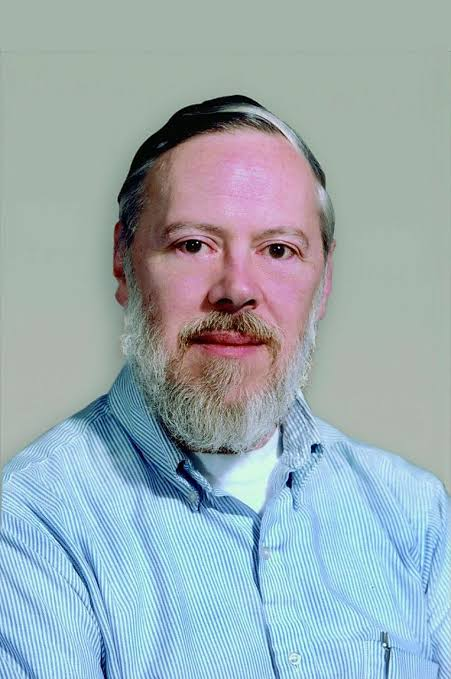

# Dennis Ritchie 

Dennis MacAlistair Ritchie (September 9, 1941 – c. October 12, 2011) was an American computer scientist.[3] He created the C programming language and the Unix operating system and B language with long-time colleague Ken Thompson.[3] Ritchie and Thompson were awarded the Turing Award from the Association for Computing Machinery (ACM) in 1983, the IEEE Richard W. Hamming Medal from the Institute of Electrical and Electronics Engineers (IEEE) in 1990, and the National Medal of Technology from President Bill Clinton in 1999.

Ritchie was the head of Lucent Technologies System Software Research Department when he retired in 2007.

## Early life and education
Dennis Ritchie was born in Bronxville, New York. His father was Alistair E. Ritchie, a longtime Bell Labs scientist and co-author of The Design of Switching Circuits on switching circuit theory. As a child, Dennis moved with his family to Summit, New Jersey, where he graduated from Summit High School.[6] He graduated from Harvard University with degrees in physics and applied mathematics in 1963.

## Career
In 1967, Ritchie began working at the Bell Labs Computing Science Research Center. In 1968, he completed a draft of his PhD thesis on "Computational Complexity and Program Structure" at Harvard under the supervision of Patrick C. Fischer. However, Ritchie never officially received his PhD degree. In 2020, the Computer History Museum worked with Ritchie's family and Fischer's family and found a copy of the lost dissertation.

During the 1960s, Ritchie and Ken Thompson worked on the Multics operating system at Bell Labs. Thompson then found an old PDP-7 machine and developed his own application programs and operating system from scratch, aided by Ritchie and others. In 1970, Brian Kernighan suggested the name "Unix", a pun on the name "Multics". To supplement assembly language with a system-level programming language, Thompson created B. Later, B was replaced by C, created by Ritchie, who continued to contribute to the development of Unix and C for many years.

During the 1970s, Ritchie collaborated with James Reeds and Robert Morris on a ciphertext-only attack on the M-209 US cipher machine that could solve messages of at least 2000–2500 letters. Ritchie relates that, after discussions with the National Security Agency, the authors decided not to publish it, as they were told that the principle applied to machines still in use by foreign governments.

Ritchie was also involved with the development of the operating systems Plan 9 and Inferno, and the programming language Limbo.

As part of an AT&T restructuring in the mid-1990s, Ritchie was transferred to Lucent Technologies, where he retired in 2007 as head of System Software Research Department.