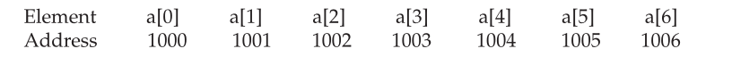

# c-programming-language
C Programming Language

## Expressions
### five basic data types
* there are five atomic data types in the C subset
	1. character				**`char`**
	2. integer					**`int`**
	3. floating-point			**`float`**
	4. double floating-point	**`double`**
	5. valueless				**`void`**

* The list of modifiers is shown here:
	* signed
	* unsigned
	* long
	* short
---
| **Type**               | **Typical size (bits)** | **Minimal Range**                            |
|------------------------|-------------------------|----------------------------------------------|
| `char`                 | 8                       | 0−127 to 127                                 |
| `unsigned char`        | 8                       | 0 to 255                                     |
| `signed char`          | 8                       | −127 to 127                                  |
| `int`                  | 16 or 32                | −32,767 to 32,767                            |
| `unsigned int`         | 16 or 32                | 0 to 65,535                                  |
| `signed int`           | 16 or 32                | same as int                                  |
| `short int`            | 16                      | −32,767 to 32,767                            |
| `unsigned short int`   | 16                      | 0 to 65,535                                  |
| `signed short int`     | 16                      | same as short int                            |
| `long int`             | 32                      | −2,147,483,647 to 2,147,483,647              |
| `signed long int`      | 32                      | same as long int                             |
| `unsigned long int`    | 32                      | 0 to 4,294,967,295                           |
| `float`                | 32                      | Six digits of precision                      |
| `double`               | 64                      | Ten digits of precision                      |
| `long double`          | 80                      | Ten digits of precision                      |
---
### Identifier Names

In C/C++, `the names of variables, functions, labels, and various other user-defined objects are called identifiers.` These identifiers can vary from one to several characters.
  
The first character must be a letter or an underscore, and subsequent characters must be either letters, digits, or underscores. Here are some correct and incorrect identifier names:
| **Correct**          | **Incorrect**    |
|----------------------|------------------|
| `Count`              |  `1count`        |
| `test23`             | `hi!there`       |
| `high_balance`       | `high...balance` |

In C, identifiers may be of any length. However, not all characters will necessarily be significant. If the identifier will be involved in an external link process, then at least the first six characters will be significant. These identifiers, called external names, include function names and global variables that are shared between files. If the identifier is not used in an external link process, then at least the first 31 characters will be significant. This type of identifier is called an internal name and includes the names of local variables, for example. In C++, there is no limit to the length of an identifier, and at least the first 1,024 characters are significant. This difference may be important if you are converting a program from C to C++.

In an identifier, upper- and lowercase are treated as distinct. Hence, count, Count, and COUNT are three separate identifiers.

An identifier cannot be the same as a C or C++ keyword, and should not have the same name as functions that are in the C or C++ library.

### Variables
As you probably know, `a variable is a named location in memory that is used to hold a value that may be modified by the program.` All variables must be declared before they can be used. The general form of a declaration is

	type variable_list;

Here, type must be a valid data type plus any modifiers, and variable_list may consist of
one or more identifier names separated by commas. Here are some declarations:
	
	int i,j,l;
	short int si;
	unsigned int ui;
	double balance, profit, loss;

**<span style="color: red;">Remember</span>: in C/C++ the name of a variable has nothing to do with its type.**

<h3><span style="color: #FF5736;">Where Variables Are Declared</span></h3>

Variables will be declared in three basic places: inside functions, in the definition of function parameters, and outside of all functions. These are local variables, formal parameters, and global variables.


<h3><span style="color: #FF5736;">Local Variables</span></h3>
Variables that are declared inside a function are called local variables. In some C/C++ literature, these variables are referred to as automatic variables. This book uses the more common term, local variable. Local variables may be referenced only by statements that are inside the block in which the variables are declared. In other words, local variables are not known outside their own code block. Remember, a block of code begins with an opening curly brace and terminates with a closing curly brace.
Local variables exist only while the block of code in which they are declared is executing. That is, a local variable is created upon entry into its block and destroyed upon exit.
The most common code block in which local variables are declared is the function. For example, consider the following two functions:

```C
	void func1(void) {
		int x;
		x = 10; 
	}
		
	void func2(void) {
		int x;
		x = -199; 
	}
```
The integer variable **`x`** is declared twice, once in **`func1()`** and once in **`func2()`**. The **`x`** in **`func1()`** has no bearing on or relationship to the **`x`** in **`func2()`**. This is because each x is known only to the code within the block in which it is declared.

The C language contains the keyword `auto`, which you can use to declare local variables. However, since all nonglobal variables are, by default, assumed to be `auto`, this keyword is virtually never used. (It has been said that `auto` was included in C to provide for source-level compatibility with its predecessor B. Further, `auto` is supported in C++ to provide compatibility with C.)

There is an important difference between C (as defined by C89) and C++ as to where you can declare local variables. In C, you must declare all local variables at the start of a block, prior to any "action" statements. For example, in C89 the following function is in error.

```C
/* 
For C89, this function is in error,
but it is perfectly acceptable for C++.
*/
void f(void) {
    int i;
    i = 10;

    int j;
	j = 20; 
}  /* this line will cause an error */
```

However, in C++, this function is perfectly valid because you can declare local variables at any point within a block, prior to their first use. (The topic of C++ variable declaration is discussed in depth in Part Two.) As a point of interest, C99 allows you to define variables at any point within a block.

Because local variables are created and destroyed with each entry and exit from the block in which they are declared, their content is lost once the block is left. This is especially important to remember when calling a function. When a function is called, its local variables are created, and upon its return they are destroyed. This means that local variables cannot retain their values between calls. (However, you can direct the compiler to retain their values by using the static modifier.)

Unless otherwise specified, local variables are stored on the stack. The fact that the stack is a dynamic and changing region of memory explains why local variables cannot, in general, hold their values between function calls.

You can initialize a local variable to some known value. This value will be assigned to the variable each time the block of code in which it is declared is entered. For example, the following program prints the number 10 ten times:

```C

#include <stdio.h>
void f(void);
   
int main(void) {
	int i;
    
	for(i=0; i<10; i++)  f();
	
	return 0; 
}

void f(void) {
	int j = 10;
     
	printf("%d ", j);
     
	j++;  /* this line has no lasting effect */
}
```
<h3><span style="color: #FF5736;">Formal Parameters</span></h3>
If a function is to use arguments, it must declare variables that will accept the values of the arguments. These variables are called the formal parameters of the function. They behave like any other local variables inside the function. As shown in the following program fragment, their declarations occur after the function name and inside parentheses:

```C       
/* Return 1 if c is part of string s; 0 otherwise */
int is_in(char *s, char c) {
    while(*s){
    	if(*s==c) {	
			return 1;
		}

        else s++;
	}

	return 0; 
}
```

<h4><span style="color: #FF5736;">Global Variables</span></h3>

Unlike local variables, global variables are known throughout the program and may be used by any piece of code. Also, they will hold their value throughout the program's execution. You create global variables by declaring them outside of any function. Any expression may access them, regardless of what block of code that expression is in.

In the following program, the variable count has been declared outside of all functions. Although its declaration occurs before the main( ) function, you could have placed it anywhere before its first use as long as it was not in a function. However, it is usually best to declare global variables at the top of the program.

```C

#include <stdio.h>

int count;  /* count is global */

void func1(void);
void func2(void);

int main(void) {
  	count = 100;
  	func1();
	return 0; 
}

void func1(void) {
	int temp;
    temp = count;
    func2();
    printf("count is %d", count); /* will print 100 */
}

void func2(void)
{
	int count;
	for(count=1; count<10; count++) {
		putchar('.');
	}
}
```
Look closely at this program. Notice that although neither main( ) nor func1( ) has declared the variable count, both may use it. func2( ), however, has declared a local variable called count. When func2( ) refers to count, it refers to only its local variable, not the global one. If a global variable and a local variable have the same name, all references to that variable name inside the code block in which the local variable is declared will refer to that local variable and have no effect on the global variable. This can be convenient, but forgetting it can cause your program to act strangely, even though it looks correct.

Storage for global variables is in a fixed region of memory set aside for this purpose by the compiler. Global variables are helpful when many functions in your program use the same data. You should avoid using unnecessary global variables, however. They take up memory the entire time your program is executing, not just when they are needed. In addition, using a global where a local variable would do makes a function less general because it relies on something that must be defined outside itself. Finally, using a large number of global variables can lead to program errors because of unknown and unwanted side effects. A major problem in developing large programs is the accidental changing of a variable's value because it was used elsewhere in the program. This can happen in C/C++ if you use too many global variables in your programs.

### The const and volatile Qualifiers

There are two qualifiers that control how variables may be accessed or modified: const and volatile. They must precede the type modifiers and the type names that they qualify. These qualifiers are formally referred to as the cv-qualifiers.

<h4><span style="color: #FF5736;">Const</span></h3>

Variables of type const may not be changed by your program. (A const variable can be given an initial value, however.) The compiler is free to place variables of this type into read-only memory (ROM). For example:

```C   
	const int a=10;
```
creates an integer variable called a with an initial value of 10 that your program may not modify. However, you can use the variable a in other types of expressions. A const variable will receive its value either from an explicit initialization or by some hardware-dependent means.

The const qualifier can be used to protect the objects pointed to by the arguments to a function from being modified by that function. That is, when a pointer is passed to a function, that function can modify the actual variable pointed to by the pointer. However, if the pointer is specified as const in the parameter declaration, the function code won't be able to modify what it points to. For example, the sp_to_dash( ) function in the following program prints a dash for each space in its string argument. That is, the string "this is a test" will be printed as "this-is-a-test". The use of const in the parameter declaration ensures that the code inside the function cannot modify the object pointed to by the parameter.

```C
#include <stdio.h>

void sp_to_dash(const char *str);

int main(void) {
	
	sp_to_dash("this is a test");

	return 0; 
}

void sp_to_dash(const char *str) {
    while(*str) {
		if(*str== ' ') printf("%c", '-');
		else printf("%c", *str);
		str++;
	} 
}
```
If you had written sp_to_dash( ) in such a way that the string would be modified, it would not compile. For example, if you had coded sp_to_dash( ) as follows, you would receive a compile-time error:

```C
/* This is wrong. */
void sp_to_dash(const char *str) {
	while(*str) {
		if(*str==' ' ) {
			*str = '-'; /* can't do this; str is const */
		}

		printf("%c", *str);
		str++;
	} 
}
```
Many functions in the standard library use const in their parameter declarations. For example, the strlen( ) function has this prototype:
```C
	size_t strlen(const char *str);
```
Specifying str as const ensures that strlen( ) will not modify the string pointed to by str. In general, when a standard library function has no need to modify an object pointed to by a calling argument, it is declared as const.

You can also use const to verify that your program does not modify a variable. Remember, a variable of type const can be modified by something outside your program. For example, a hardware device may set its value. However, by declaring a variable as const, you can prove that any changes to that variable occur because of external events.

<h4><span style="color: #FF5736;">volatile</span></h3>

The modifier volatile tells the compiler that a variable's value may be changed in ways not explicitly specified by the program. For example, a global variable's address may be passed to the operating system's clock routine and used to hold the real time of the system. In this situation, the contents of the variable are altered without any explicit assignment statements in the program. This is important because most C/C++ compilers automatically optimize certain expressions by assuming that a variable's content is unchanging if it does not occur on the left side of an assignment statement; thus, it might not be reexamined each time it is referenced. Also, some compilers change the order of evaluation of an expression during the compilation process. The volatile modifier prevents these changes. 

You can use const and volatile together. For example, if 0x30 is assumed to be the value of a port that is changed by external conditions only, the following declaration would prevent any possibility of accidental side effects:
```C
    const volatile char *port = (const volatile char *) 0x30;
```

## Statements
This chapter discusses the statement. In the most general sense, a statement is a part of your program that can be executed. That is, a statement specifies an action. C and C++ categorize statements into these groups:

*statement - this, collection of commands*

■ Selection </br>
■ Iteration </br>
■ Jump </br>
■ Label </br>
■ Expression </br>
■ Block </br>

Included in the selection statements are `if` and `switch`. (The term conditional statement is often used in place of "selection statement.") The iteration statements are `while`, `for`, and `do-while`. These are also commonly called loop statements. The jump statements are `break`, `continue`, `goto`, and `return`. The label statements include the `case` and `default` statements (discussed along with the `switch` statement) and the label statement (discussed with `goto`). Expression statements are statements composed of a valid expression. Block statements are simply blocks of code. (Remember, a block begins with a { and ends with a }.) Block statements are also referred to as compound statements.

*`C++ adds two additional statement types: the try block (used by exception handling) and the declaration statement. These are discussed in Part Two`*

Since many statements rely upon the outcome of some conditional test, let's begin by reviewing the concepts of true and false.

### True and False in C and C++

Many C/C++ statements rely upon a conditional expression that determines what course of action is to be taken. A conditional expression evaluates to either a true or false value. In C, a true value is any nonzero value, including negative numbers. A false value is 0. This approach to true and false allows a wide range of routines to be coded extremely efficiently.

C++ fully supports the zero/nonzero definition of true and false just described. But C++ also defines a Boolean data type called bool, which can have only the values true and false. As explained in Chapter 2, in C++, a 0 value is automatically converted into false and a nonzero value is automatically converted into true. The reverse also applies: true converts to 1 and false converts to 0. In C++, the expression that controls a conditional statement is technically of type bool. But since any nonzero value converts to true and any zero value converts to false, there is no practical difference between C and C++ on this point.

### Selection Statements
C/C++ supports two types of selection statements: if and switch. In addition, the ? operator is an alternative to if in certain circumstances.

#### if

The general form of the if statement is

```C
	if (expression) {
		// statement
	} else {
		// statement
	}
```
where a statement may consist of a single statement, a block of statements, or nothing
(in the case of empty statements). The else clause is optional. 

If expression evaluates to true (anything other than 0), the statement or block that forms the target of if is executed; otherwise, the statement or block that is the targetof else will be executed, if it exists. Remember, only the code associated with if or the code associated with else executes, never both.

In C, the conditional statement controlling if must produce a scalar result. A scalar is either an integer, character, pointer, or floating-point type. In C++, it may also be of type bool. It is rare to use a floating-point number to control a conditional statement because this slows execution time considerably. (It takes several instructions to perform a floating-point operation. It takes relatively few instructions to perform an integer or character operation.)

The following program contains an example of if. The program plays a very simple version of the "guess the magic number" game. It prints the message ** Right ** when the player guesses the magic number. It generates the magic number using the standard random number generator rand( ), which returns an arbitrary number between 0 and RAND_MAX (which defines an integer value that is 32,767 or larger). rand( ) requires the header file stdlib.h. (A C++ program may also use the new-style header <cstdlib>.)

```C
/* Magic number program #1. */
#include <stdio.h>
#include <stdlib.h>

int main(void) {
	int magic; /* magic number */
	int guess; /* user's guess */
	
	magic = rand(); /* generate the magic number */
	
	printf("Guess the magic number: ");
	scanf("%d", &guess);
	
	if(guess == magic) {
		printf("** Right **");
	}

	return 0;
}
```

Taking the magic number program further, the next version illustrates the use of the else statement to print a message in response to the wrong number.
```C
/* Magic number program #2. */
#include <stdio.h>
#include <stdlib.h>

int main(void) {
	int magic; /* magic number */
	int guess; /* user's guess */
	
	magic = rand(); /* generate the magic number */
	
	printf("Guess the magic number: ");
	scanf("%d", &guess);
	
	if(guess == magic) {
		printf("** Right **");
	} else {
		printf("Wrong");
	}
	
	return 0;
}
```
#### Nested ifs

## **Pointers**
The correct understanding and use of pointers is critical to successful C/C++ programming. There are three reasons for this: First, pointers provide the means
by which functions can modify their calling arguments. Second, pointers support dynamic allocation. Third, pointers can improve the efficiency of certain routines. Also,
as you will see in Part Two, pointers take on additional roles in C++.

Pointers are one of the strongest but also one of the most dangerous features in C/C++. For example, uninitialized pointers (or pointers containing invalid values)
can cause your system to crash. Perhaps worse, it is easy to use pointers incorrectly, causing bugs that are very difficult to find. 

Because of both their importance and their potential for abuse, this chapter examines the subject of pointers in detail.

### Pointer nima?
A pointer is a variable that holds a memory address. This address is the location of another object (typically another variable) in memory. For example, if one variable
contains the address of another variable, the first variable is said to point to the second. Figure 5-1 illustrates this situation.

 

<!--  -->
One variable points to another

### Pointer o'zgaruvchi
If a variable is going to hold a pointer, it must be declared as such. A pointer declaration consists of a base type, an *, and the variable name. The general form for declaring a pointer variable is:
```C
	type *name;
```
where `type` is the base type of the pointer and may be any valid type. The name of the pointer variable is specified by name. The base type of the pointer defines what type of variables the pointer can point to.

Technically, any type of pointer can point anywhere in memory. However, all pointer arithmetic is done relative to its base type, so it is important to declare the pointer correctly. (Pointer arithmetic is discussed later in this chapter.)

### **The Pointer Operators**
The pointer operators were discussed in Chapter 2. We will take a closer look at them here, beginning with a review of their basic operation. There are two special pointer operators: * and &. The & is a unary operator that returns the memory address of its operand. (Remember, a unary operator only requires one operand.) For example,

```C
	m = &count;
```
places into m the memory address of the variable count. This address is the computer's internal location of the variable. It has nothing to do with the value of count. You can think of & as returning "the address of." Therefore, the preceding assignment statement means "m receives the address of count."

To understand the above assignment better, assume that the variable count uses memory location 2000 to store its value. Also assume that count has a value of 100. Then, after the preceding assignment, m will have the value 2000.

The second pointer operator, *, is the complement of &. It is a unary operator that returns the value located at the address that follows. For example, if m contains the memory address of the variable count,

```C
	q = *m;
```
places the value of count into q. Thus, q will have the value 100 because 100 is stored at location 2000, which is the memory address that was stored in m. You can think of * as "at address." In this case, the preceding statement means "q receives the value at address m."

Both & and * have a higher precedence than all other arithmetic operators except the unary minus, with which they are equal.

You must make sure that your pointer variables always point to the correct type of data. For example, when you declare a pointer to be of type int, the compiler assumes that any address that it holds points to an integer variable—whether it actually does or not. Because you can assign any address you want to a pointer variable, the following program compiles without error, but does not produce the desired result:


```C
#include <stdio.h>

int main(void) {
	double x = 100.1, y;
	int *p;
	/* The next statement causes p (which is an
		integer pointer) to point to a double. */
	
	p = (int *)&x;
	/* The next statement does not operate as
		expected. */
	y = *p;
	printf("%f", y); /* won't output 100.1 */
	return 0;
}
```

This will not assign the value of x to y. Because p is declared as an integer pointer, only 4 bytes of information (assuming 4-byte integers) will be transferred to y, not the 8 bytes that normally make up a double.

*In C++, it is illegal to convert one type of pointer into another without the use of an explicit type cast. In C, casts should be used for most pointer conversions.*

### Pointer Expressions
In general, expressions involving pointers conform to the same rules as other expressions. This section examines a few special aspects of pointer expressions.

As with any variable, you may use a pointer on the right-hand side of an assignment statement to assign its value to another pointer. For example,
```C
#include <stdio.h>
int main(void) {
	int x;
	int *p1, *p2;
	
	p1 = &x;
	p2 = p1;
	
	printf(" %p", p2); /* print the address of x, not x's value! */
	
	return 0;
}
```
Both p1 and p2 now point to x. The address of x is displayed by using the %p printf( ) format specifier, which causes printf( ) to display an address in the format used by the host computer.

### Pointer Arithmetic
There are only two arithmetic operations that you may use on pointers: addition and subtraction. To understand what occurs in pointer arithmetic, let p1 be an integer pointer with a current value of 2000. Also, assume integers are 2 bytes long. After the expression
```C
	p1++;
```

p1 contains 2002, not 2001. The reason for this is that each time p1 is incremented, it will point to the next integer. The same is true of decrements. For example, assuming that p1 has the value 2000, the expression
```C
	p1--;
```
causes p1 to have the value 1998.

Generalizing from the preceding example, the following rules govern pointer arithmetic. Each time a pointer is incremented, it points to the memory location of the next element of its base type. Each time it is decremented, it points to the location of the previous element. When applied to character pointers, this will appear as "normal" arithmetic because characters are always 1 byte long. All other pointers will increase or decrease by the length of the data type they point to. This approach ensures that a pointer is always pointing to an appropriate element of its base type. Figure 5-2 illustrates this concept.

You are not limited to the increment and decrement operators. For example, you may add or subtract integers to or from pointers. The expression
```C
	p1 = p1 + 12;
```
makes p1 point to the twelfth element of p1's type beyond the one it currently points to.

Besides addition and subtraction of a pointer and an integer, only one other arithmetic operation is allowed: You may subtract one pointer from another in order to find the number of objects of their base type that separate the two. All other arithmetic operations are prohibited. Specifically, you may not multiply or divide pointers; you may not add two pointers; you may not apply the bitwise operators to them; and you may not add or subtract type float or double to or from pointers.

 
All pointer arithmetic is relative to its base type (assume 2-byte integers)

### Pointer Comparisons
You can compare two pointers in a relational expression. For instance, given two pointers p and q, the following statement is perfectly valid:
```C
	       if(p<q) printf("p points to lower memory than q\n");
```

Generally, pointer comparisons are used when two or more pointers point to a common object, such as an array. As an example, a pair of stack routines are developed that store and retrieve integer values. A stack is a list that uses first-in, last-out accessing. It is often compared to a stack of plates on a table—the first one set down is the last one to be used. Stacks are used frequently in compilers, interpreters, spreadsheets, and other system-related software. To create a stack, you need two functions: push( ) and pop( ). The push( ) function places values on the stack and pop( ) takes them off. These routines are shown here with a simple main( ) function to drive them. The program puts the values you enter into the stack. If you enter 0, a value is popped from the stack. To stop the program, enter 1.
```C
#include <stdio.h>
#include <stdlib.h>

#define SIZE 50
void push(int i);
int pop(void);
int  *tos, *p1, stack[SIZE];
int main(void) {
	int value;
    tos = stack; /* tos points to the top of stack */
    p1 = stack; /* initialize p1 */
    do {
        printf("Enter value: ");
        scanf("%d", &value);
        if(value!=0) push(value);
        else printf("value on top is %d\n", pop());
    } while(value!=-1);
	
	return 0; 
}
   
void push(int i) {
    p1++;
    
	if(p1==(tos+SIZE)) {
       	printf("Stack Overflow.\n");
		exit(1); 
	}
		
	*p1 = i; 
}

int pop(void) {
    if(p1==tos) {
       	printf("Stack Underflow.\n");
       	exit(1);
    }
     
	p1--;
     
	return *(p1+1);
}
```
You can see that memory for the stack is provided by the array stack. 

The pointer p1 is set to point to the first element in stack. The p1 variable accesses the stack. The variable tos holds the memory address of the top of the stack. It is used to prevent stack overflows and underflows. Once the stack has been initialized, push( ) and pop( ) may be used. Both the push( ) and pop( ) functions perform a relational test on the pointer p1 to detect limit errors. In push( ), p1 is tested against the end of stack by adding SIZE (the size of the stack) to tos. 

This prevents an overflow. In pop( ), p1 is checked against tos to be sure that a stack underflow has not occurred. 

In pop( ), the parentheses are necessary in the return statement. Without them, the statement would look like this:
```C
	return *p1 +1;
```
which would return the value at location p1 plus one, not the value of the location p1+1.

## Arrays and Null-Terminated Strings
An array is a collection of variables of the same type that are referred to through a common name. A specific element in an array is accessed by an index.

In C/C++, all arrays consist of contiguous memory locations. The lowest address corresponds to the first element and the highest address to the last element. Arrays may have from one to several dimensions. The most common array is the null-terminated string, which is simply an array of characters terminated by a null.

Arrays and pointers are closely related; a discussion of one usually refers to the other. This chapter focuses on arrays, while Chapter 5 looks closely at pointers. You should read both to understand fully these important constructs.

### Single-Dimension Arrays
The general form for declaring a single-dimension array is
```C
	type var_name[size];
```
Like other variables, arrays must be explicitly declared so that the compiler may allocate space for them in memory. Here, type declares the base type of the array, which is the type of each element in the array, and size defines how many elements the array will hold. For example, to declare a 100-element array called balance of type double, use this statement:
```C
	double balance[100];
```
An element is accessed by indexing the array name. This is done by placing the index of the element within square brackets after the name of the array. For example,
```c
	balance[3] = 12.23;
```
assigns element number 3 in balance the value 12.23.

In C/C++, all arrays have 0 as the index of their first element. Therefore, when you write 
```c
char p[10];
```
you are declaring a character array that has ten elements, p[0] through p[9]. For example,
the following program loads an integer array with the numbers 0 through 99:
```c
#include <stdio.h>
int main(void) {
	int x[100]; /* this declares a 100-integer array */
	int t;
	
	/* load x with values 0 through 99 */
	for(t=0; t<100; ++t) {
		x[t] = t
	}

	/* display contents of x */
	for(t=0; t<100; ++t) {
		printf("%d ", x[t])
	}
	
	return 0;
}
```

The amount of storage required to hold an array is directly related to its type and size. For a single-dimension array, the total size in bytes is computed as shown here:
```c
	total bytes = sizeof(base type) x size of array
```

C/C++ has no bounds checking on arrays. You could overwrite either end of an array and write into some other variable's data or even into the program's code. As the programmer, it is your job to provide bounds checking where needed. For example, this code will compile without error, but is incorrect because the for loop will cause the array count to be overrun.

```c
	int count[10], i;
	
	/* this causes count to be overrun */
	for(i=0; i<100; i++) count[i] = i;
```
Single-dimension arrays are essentially lists of information of the same type that are stored in contiguous memory locations in index order. For example, Figure 4-1 shows how array a appears in memory if it starts at memory location 1000 and is declared as shown here:
```c
	char a[7];
```
 
A seven-element character array beginning at location 1000

### Generating a Pointer to an Array
You can generate a pointer to the first element of an array by simply specifying the array name, without any index. For example, given
```c
	int sample[10];
```
you can generate a pointer to the first element by using the name sample. Thus, the following program fragment assigns p the address of the first element of sample:
```c
	int *p;
	int sample[10];

	p = sample;
```
You can also specify the address of the first element of an array using the & operator.
For example, sample and &sample[0] both produce the same results. 
However, in professionally written C/C++ code, you will almost never see &sample[0].

### Passing Single-Dimension Arrays to Functions
In C/C++, you cannot pass an entire array as an argument to a function. You can, however, pass to the function a pointer to an array by specifying the array's name without an index. For example, the following program fragment passes the address of i to func1( ):
```c
int main(void) {
	int i[10];

	func1(i);
	.
	.
	.
}
```
If a function receives a single-dimension array, you may declare its formal parameter in one of three ways: as a pointer, as a sized array, or as an unsized array. For example, to receive i, a function called func1( ) can be declared as **pointer**
```C
void func1(int *x) {
	.
	.
	.
} 
```
or as **sized array**
```C
void func1(int x[10]) {
	.
	.
	.
}
```
or finaly as **unsized array**
```c
void func1(int x[]) {
	.
	.
	.
}
```
All three declaration methods produce similar results because each tells the compiler that an integer pointer is going to be received. The first declaration actually uses a pointer. The second employs the standard array declaration. In the final version, a modified version of an array declaration simply specifies that an array of type int of some length is to be received. As you can see, the length of the array doesn't matter as far as the function is concerned because C/C++ performs no bounds checking. In fact, as far as the compiler is concerned,
```c
void func1(int x[32]) {
	.
	.
	.
}
```
also works because the compiler generates code that instructs func1( ) to receive a pointer—it does not actually create a 32-element array.

### Null-Terminated Strings
By far the most common use of the one-dimensional array is as a character string. C++ supports two types of strings. The first is the null-terminated string, which is a null-terminated character array. (A null is zero.) Thus a null-terminated string contains the characters that comprise the string followed by a null. This is the only type of string defined by C, and it is still the most widely used. Sometimes null-terminated strings are called C-strings. C++ also defines a string class, called string, which provides an object-oriented approach to string handling. It is described later in this book. Here, null-terminated strings are examined.

When declaring a character array that will hold a null-terminated string, you need to declare it to be one character longer than the largest string that it is to hold. For example, to declare an array str that can hold a 10-character string, you would write

```c
	char str[11];
```
This makes room for the null at the end of the string.

When you use a quoted string constant in your program, you are also creating a null-terminated string. A string constant is a list of characters enclosed in double quotes. For example,
```c
	"hello there"
```
You do not need to add the null to the end of string constants manually—the compiler does this for you automatically.

C/C++ supports a wide range of functions that manipulate null-terminated strings. The most common are

---
| **Function**     | **Description**                                                                                   |
|------------------|---------------------------------------------------------------------------------------------------|
| `strcpy(s1, s2)` | Copies `s2` into `s1`.                                                                             |
| `strcat(s1, s2)` | Concatenates `s2` onto the end of `s1`.                                                            |
| `strlen(s1)`     | Returns the length of `s1`.                                                                        |
| `strcmp(s1, s2)` | Returns 0 if `s1` and `s2` are the same; less than 0 if `s1` < `s2`; greater than 0 if `s1` > `s2`.|
| `strchr(s1, ch)` | Returns a pointer to the first occurrence of `ch` in `s1`.                                         |
| `strstr(s1, s2)` | Returns a pointer to the first occurrence of `s2` in `s1`.                                         |
---
These functions use the standard header file string.h. 

(C++ programs can also use the C++-style header <cstring>.) The following program illustrates the use of these string functions:
```c
#include <stdio.h>
#include <string.h>

int main(void) {
	char s1[80], s2[80];
	
	gets(s1);
	gets(s2);
	
	printf("lengths: %d %d\n", strlen(s1), strlen(s2));
	
	if(!strcmp(s1, s2)) printf("The strings are equal\n");
	
	strcat(s1, s2);
	printf("%s\n", s1);
	
	strcpy(s1, "This is a test.\n");
	printf(s1);
	
	if(strchr("hello", 'e')) printf("e is in hello\n");
	
	if(strstr("hi there", "hi")) printf("found hi");
	
	return 0;
}
```

If you run this program and enter the strings "hello" and "hello", the output is
```txt
	lengths: 5 5
	The strings are equal
	hellohello
	This is a test.
	e is in hello
	found hi
```

Remember, strcmp( ) returns false if the strings are equal. Be sure to use the logical operator ! to reverse the condition, as just shown, if you are testing for equality.

Although C++ defines a string class, null-terminated strings are still widely used in existing programs. They will probably stay in wide use because they offer a high level of efficiency and afford the programmer detailed control of string operations.

However, for many simple string-handling chores, C++'s string class provides a convenient alternative.

### Two-Dimensional Arrays
C/C++ supports multidimensional arrays. The simplest form of the multidimensional array is the two-dimensional array. A two-dimensional array is, essentially, an array of one-dimensional arrays. To declare a two-dimensional integer array d of size 10,20, you would write
```c
	int d[10][20];
```
Pay careful attention to the declaration. Some other computer languages use commas to separate the array dimensions; C/C++, in contrast, places each dimension in its own set of brackets. Similarly, to access point 1,2 of array d, you would use
```c
	d[1][2]
```
The following example loads a two-dimensional array with the numbers 1 through 12 and prints them row by row.
```c
#include <stdio.h>

int main(void) {
	int t, i, num[3][4];
	
	for(t=0; t<3; ++t){
		for(i=0; i<4; ++i) {
			num[t][i] = (t*4)+i+1;
		}
	}
	/* now print them out */
	for(t=0; t<3; ++t) {
		for(i=0; i<4; ++i) {
			printf("%3d ", num[t][i]);
		}

		printf("\n");
	}

	return 0;
}
```

In this example, num[0][0] has the value 1, num[0][1] the value 2, num[0][2] the value 3, and so on. The value of num[2][3] will be 12. You can visualize the num array as
shown here:

 

Two-dimensional arrays are stored in a row-column matrix, where the first index indicates the row and the second indicates the column. This means that the rightmost index changes faster than the leftmost when accessing the elements in the array in the order in which they are actually stored in memory. See Figure 4-2 for a graphic representation of a two-dimensional array in memory.

In the case of a two-dimensional array, the following formula yields the number of bytes of memory needed to hold it:
```c
	bytes = size of 1st index x size of 2nd index x sizeof(base type)
```

Therefore, assuming 4-byte integers, an integer array with dimensions 10,5 would have
	
- 10 x 5 x 4

or 200 bytes allocated.

 

When a two-dimensional array is used as an argument to a function, only a pointer to the first element is actually passed. However, the parameter receiving a two-dimensional array must define at least the size of the rightmost dimension. (You can specify the left dimension if you like, but it is not necessary.) The rightmost dimension is needed because the compiler must know the length of each row if it is to index the array correctly. For example, a function that receives a two-dimensional integer array with dimensions 10,10 is declared like this:
```c
void func1(int x[][10]) {
	.
	.
	.
}
```
The compiler needs to know the size of the right dimension in order to correctly
execute expressions such as
```c
	x[2][4]
```
inside the function. If the length of the rows is not known, the compiler cannot determine where the third row begins. 

The following short program uses a two-dimensional array to store the numeric grade for each student in a teacher's classes. 

The program assumes that the teacher has three classes and a maximum of 30 students per class. Notice the way the array grade is accessed by each of the functions.

```c
/* A simple student grades database. */
#include <stdio.h>
#include <ctype.h>
#include <stdlib.h>

#define CLASSES 3
#define GRADES 30

int grade[CLASSES][GRADES];

void enter_grades(void);
int get_grade(int num);
void disp_grades(int g[][GRADES]);

int main(void) {
	char ch, str[80];
	
	for(;;) {
		do {
			printf("(E)nter grades\n");
			printf("(R)eport grades\n");
			printf("(Q)uit\n");
			
			gets(str);
			ch = toupper(*str);
		} while(ch!='E' && ch!='R' && ch!='Q');
		
		switch(ch) {
			case 'E':
				enter_grades();
				break;
			case 'R':
				disp_grades(grade);
				break;
			case 'Q':
				exit(0);
		}
	}
	return 0;
}
/* Enter thestudent's grades. */
void enter_grades(void) {
	int t, i;
	
	for(t=0; t<CLASSES; t++) {
		printf("Class # %d:\n", t+1);
		
		for(i=0; i<GRADES; ++i)
			grade[t][i] = get_grade(i);
	}
}

/* Read a grade. */
int get_grade(int num) {
	char s[80];
	
	printf("Enter grade for student # %d:\n", num+1);
	
	gets(s);
	
	return(atoi(s));
}

/* Display grades. */
void disp_grades(int g[][GRADES]) {
	int t, i;
	
	for(t=0; t<CLASSES; ++t) {
		printf("Class # %d:\n", t+1);
		
		for(i=0; i<GRADES; ++i)
			printf("Student #%d is %d\n", i+1, g[t][i]);
	}
}
```
### Arrays of Strings
It is not uncommon in programming to use an array of strings. For example, the input processor to a database may verify user commands against an array of valid commands. To create an array of null-terminated strings, use a two-dimensional character array.

The size of the left index determines the number of strings and the size of the right index specifies the maximum length of each string. The following code declares an array of 30 strings, each with a maximum length of 79 characters, plus the null terminator.
```c
char str_array[30][80];
```
It is easy to access an individual string: You simply specify only the left index.
For example, the following statement calls gets( ) with the third string in str_array.
```c
gets(str_array[2]);
```
The preceding statement is functionally equivalent to
```c
gets(&str_array[2][0]);
```
but the first of the two forms is much more common in professionally written C/C++ code.

To better understand how string arrays work, study the following short program, which uses a string array as the basis for a very simple text editor:
```c
/* A very simple text editor. */
#include <stdio.h>

#define MAX 100
#define LEN 80

char text[MAX][LEN];
int main(void) {
	register int t, i, j;
	
	printf("Enter an empty line to quit.\n");
	
	for(t=0; t<MAX; t++) {
		printf("%d: ", t);
		gets(text[t]);
		
		if(!*text[t]) break; /* quit on blank line */
	}

	for(i=0; i<t; i++) {
		for(j=0; text[i][j]; j++) putchar(text[i][j]);
		
		putchar('\n');
	}
	
	return 0;
}
```
This program inputs lines of text until a blank line is entered. Then it redisplays each line one character at a time.

### Multidimensional Arrays
C/C++ allows arrays of more than two dimensions. The exact limit, if any, is determined by your compiler. The general form of a multidimensional array declaration is
```c
	type name[Size1][Size2][Size3]. . .[SizeN];
```

Arrays of more than three dimensions are not often used because of the amount of memory they require. For example, a four-dimensional character array with dimensions 10,6,9,4 requires

	10 * 6 * 9 * 4

or 2,160 bytes. If the array held 2-byte integers, 4,320 bytes would be needed. If the array held doubles (assuming 8 bytes per double), 17,280 bytes would be required. The storage required increases exponentially with the number of dimensions. For example, if a fifth dimension of size 10 was added to the preceding array, then 172, 800 bytes would be required.

In multidimensional arrays, it takes the computer time to compute each index.

This means that accessing an element in a multidimensional array can be slower than accessing an element in a single-dimension array.

When passing multidimensional arrays into functions, you must declare all but the leftmost dimension. For example, if you declare array m as

```c
	int m[4][3][6][5];
```

a function, func1( ), that receives m, would look like this:
```c
void func1(int d[][3][6][5]) {
	.
	.
	.
}
```
Of course, you can include the first dimension if you like.