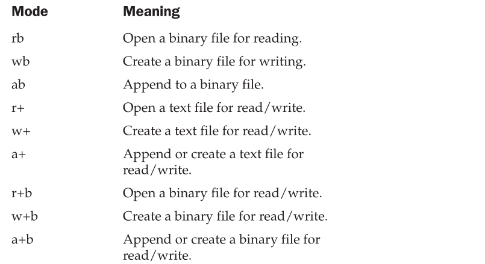

# c-programming-language
C Programming Language

## Expressions
### five basic data types
* there are five atomic data types in the C subset
	1. character				**`char`**
	2. integer					**`int`**
	3. floating-point			**`float`**
	4. double floating-point	**`double`**
	5. valueless				**`void`**

* The list of modifiers is shown here:
	* signed
	* unsigned
	* long
	* short
---
| **Type**               | **Typical size (bits)** | **Minimal Range**                            |
|------------------------|-------------------------|----------------------------------------------|
| `char`                 | 8                       | 0−127 to 127                                 |
| `unsigned char`        | 8                       | 0 to 255                                     |
| `signed char`          | 8                       | −127 to 127                                  |
| `int`                  | 16 or 32                | −32,767 to 32,767                            |
| `unsigned int`         | 16 or 32                | 0 to 65,535                                  |
| `signed int`           | 16 or 32                | same as int                                  |
| `short int`            | 16                      | −32,767 to 32,767                            |
| `unsigned short int`   | 16                      | 0 to 65,535                                  |
| `signed short int`     | 16                      | same as short int                            |
| `long int`             | 32                      | −2,147,483,647 to 2,147,483,647              |
| `signed long int`      | 32                      | same as long int                             |
| `unsigned long int`    | 32                      | 0 to 4,294,967,295                           |
| `float`                | 32                      | Six digits of precision                      |
| `double`               | 64                      | Ten digits of precision                      |
| `long double`          | 80                      | Ten digits of precision                      |
---
### Identifier Names

In C/C++, `the names of variables, functions, labels, and various other user-defined objects are called identifiers.` These identifiers can vary from one to several characters.
  
The first character must be a letter or an underscore, and subsequent characters must be either letters, digits, or underscores. Here are some correct and incorrect identifier names:
| **Correct**          | **Incorrect**    |
|----------------------|------------------|
| `Count`              |  `1count`        |
| `test23`             | `hi!there`       |
| `high_balance`       | `high...balance` |

In C, identifiers may be of any length. However, not all characters will necessarily be significant. If the identifier will be involved in an external link process, then at least the first six characters will be significant. These identifiers, called external names, include function names and global variables that are shared between files. If the identifier is not used in an external link process, then at least the first 31 characters will be significant. This type of identifier is called an internal name and includes the names of local variables, for example. In C++, there is no limit to the length of an identifier, and at least the first 1,024 characters are significant. This difference may be important if you are converting a program from C to C++.

In an identifier, upper- and lowercase are treated as distinct. Hence, count, Count, and COUNT are three separate identifiers.

An identifier cannot be the same as a C or C++ keyword, and should not have the same name as functions that are in the C or C++ library.

### Variables
As you probably know, `a variable is a named location in memory that is used to hold a value that may be modified by the program.` All variables must be declared before they can be used. The general form of a declaration is

	type variable_list;

Here, type must be a valid data type plus any modifiers, and variable_list may consist of
one or more identifier names separated by commas. Here are some declarations:
	
	int i,j,l;
	short int si;
	unsigned int ui;
	double balance, profit, loss;

**<span style="color: red;">Remember</span>: in C/C++ the name of a variable has nothing to do with its type.**

<h3><span style="color: #FF5736;">Where Variables Are Declared</span></h3>

Variables will be declared in three basic places: inside functions, in the definition of function parameters, and outside of all functions. These are local variables, formal parameters, and global variables.


<h3><span style="color: #FF5736;">Local Variables</span></h3>
Variables that are declared inside a function are called local variables. In some C/C++ literature, these variables are referred to as automatic variables. This book uses the more common term, local variable. Local variables may be referenced only by statements that are inside the block in which the variables are declared. In other words, local variables are not known outside their own code block. Remember, a block of code begins with an opening curly brace and terminates with a closing curly brace.
Local variables exist only while the block of code in which they are declared is executing. That is, a local variable is created upon entry into its block and destroyed upon exit.
The most common code block in which local variables are declared is the function. For example, consider the following two functions:

```C
	void func1(void) {
		int x;
		x = 10; 
	}
		
	void func2(void) {
		int x;
		x = -199; 
	}
```
The integer variable **`x`** is declared twice, once in **`func1()`** and once in **`func2()`**. The **`x`** in **`func1()`** has no bearing on or relationship to the **`x`** in **`func2()`**. This is because each x is known only to the code within the block in which it is declared.

The C language contains the keyword `auto`, which you can use to declare local variables. However, since all nonglobal variables are, by default, assumed to be `auto`, this keyword is virtually never used. (It has been said that `auto` was included in C to provide for source-level compatibility with its predecessor B. Further, `auto` is supported in C++ to provide compatibility with C.)

There is an important difference between C (as defined by C89) and C++ as to where you can declare local variables. In C, you must declare all local variables at the start of a block, prior to any "action" statements. For example, in C89 the following function is in error.

```C
/* 
For C89, this function is in error,
but it is perfectly acceptable for C++.
*/
void f(void) {
    int i;
    i = 10;

    int j;
	j = 20; 
}  /* this line will cause an error */
```

However, in C++, this function is perfectly valid because you can declare local variables at any point within a block, prior to their first use. (The topic of C++ variable declaration is discussed in depth in Part Two.) As a point of interest, C99 allows you to define variables at any point within a block.

Because local variables are created and destroyed with each entry and exit from the block in which they are declared, their content is lost once the block is left. This is especially important to remember when calling a function. When a function is called, its local variables are created, and upon its return they are destroyed. This means that local variables cannot retain their values between calls. (However, you can direct the compiler to retain their values by using the static modifier.)

Unless otherwise specified, local variables are stored on the stack. The fact that the stack is a dynamic and changing region of memory explains why local variables cannot, in general, hold their values between function calls.

You can initialize a local variable to some known value. This value will be assigned to the variable each time the block of code in which it is declared is entered. For example, the following program prints the number 10 ten times:

```C

#include <stdio.h>
void f(void);
   
int main(void) {
	int i;
    
	for(i=0; i<10; i++)  f();
	
	return 0; 
}

void f(void) {
	int j = 10;
     
	printf("%d ", j);
     
	j++;  /* this line has no lasting effect */
}
```
<h3><span style="color: #FF5736;">Formal Parameters</span></h3>
If a function is to use arguments, it must declare variables that will accept the values of the arguments. These variables are called the formal parameters of the function. They behave like any other local variables inside the function. As shown in the following program fragment, their declarations occur after the function name and inside parentheses:

```C       
/* Return 1 if c is part of string s; 0 otherwise */
int is_in(char *s, char c) {
    while(*s){
    	if(*s==c) {	
			return 1;
		}

        else s++;
	}

	return 0; 
}
```

<h4><span style="color: #FF5736;">Global Variables</span></h3>

Unlike local variables, global variables are known throughout the program and may be used by any piece of code. Also, they will hold their value throughout the program's execution. You create global variables by declaring them outside of any function. Any expression may access them, regardless of what block of code that expression is in.

In the following program, the variable count has been declared outside of all functions. Although its declaration occurs before the main( ) function, you could have placed it anywhere before its first use as long as it was not in a function. However, it is usually best to declare global variables at the top of the program.

```C

#include <stdio.h>

int count;  /* count is global */

void func1(void);
void func2(void);

int main(void) {
  	count = 100;
  	func1();
	return 0; 
}

void func1(void) {
	int temp;
    temp = count;
    func2();
    printf("count is %d", count); /* will print 100 */
}

void func2(void)
{
	int count;
	for(count=1; count<10; count++) {
		putchar('.');
	}
}
```
Look closely at this program. Notice that although neither main( ) nor func1( ) has declared the variable count, both may use it. func2( ), however, has declared a local variable called count. When func2( ) refers to count, it refers to only its local variable, not the global one. If a global variable and a local variable have the same name, all references to that variable name inside the code block in which the local variable is declared will refer to that local variable and have no effect on the global variable. This can be convenient, but forgetting it can cause your program to act strangely, even though it looks correct.

Storage for global variables is in a fixed region of memory set aside for this purpose by the compiler. Global variables are helpful when many functions in your program use the same data. You should avoid using unnecessary global variables, however. They take up memory the entire time your program is executing, not just when they are needed. In addition, using a global where a local variable would do makes a function less general because it relies on something that must be defined outside itself. Finally, using a large number of global variables can lead to program errors because of unknown and unwanted side effects. A major problem in developing large programs is the accidental changing of a variable's value because it was used elsewhere in the program. This can happen in C/C++ if you use too many global variables in your programs.

### The const and volatile Qualifiers

There are two qualifiers that control how variables may be accessed or modified: const and volatile. They must precede the type modifiers and the type names that they qualify. These qualifiers are formally referred to as the cv-qualifiers.

<h4><span style="color: #FF5736;">Const</span></h3>

Variables of type const may not be changed by your program. (A const variable can be given an initial value, however.) The compiler is free to place variables of this type into read-only memory (ROM). For example:

```C   
	const int a=10;
```
creates an integer variable called a with an initial value of 10 that your program may not modify. However, you can use the variable a in other types of expressions. A const variable will receive its value either from an explicit initialization or by some hardware-dependent means.

The const qualifier can be used to protect the objects pointed to by the arguments to a function from being modified by that function. That is, when a pointer is passed to a function, that function can modify the actual variable pointed to by the pointer. However, if the pointer is specified as const in the parameter declaration, the function code won't be able to modify what it points to. For example, the sp_to_dash( ) function in the following program prints a dash for each space in its string argument. That is, the string "this is a test" will be printed as "this-is-a-test". The use of const in the parameter declaration ensures that the code inside the function cannot modify the object pointed to by the parameter.

```C
#include <stdio.h>

void sp_to_dash(const char *str);

int main(void) {
	
	sp_to_dash("this is a test");

	return 0; 
}

void sp_to_dash(const char *str) {
    while(*str) {
		if(*str== ' ') printf("%c", '-');
		else printf("%c", *str);
		str++;
	} 
}
```
If you had written sp_to_dash( ) in such a way that the string would be modified, it would not compile. For example, if you had coded sp_to_dash( ) as follows, you would receive a compile-time error:

```C
/* This is wrong. */
void sp_to_dash(const char *str) {
	while(*str) {
		if(*str==' ' ) {
			*str = '-'; /* can't do this; str is const */
		}

		printf("%c", *str);
		str++;
	} 
}
```
Many functions in the standard library use const in their parameter declarations. For example, the strlen( ) function has this prototype:
```C
	size_t strlen(const char *str);
```
Specifying str as const ensures that strlen( ) will not modify the string pointed to by str. In general, when a standard library function has no need to modify an object pointed to by a calling argument, it is declared as const.

You can also use const to verify that your program does not modify a variable. Remember, a variable of type const can be modified by something outside your program. For example, a hardware device may set its value. However, by declaring a variable as const, you can prove that any changes to that variable occur because of external events.

<h4><span style="color: #FF5736;">volatile</span></h3>

The modifier volatile tells the compiler that a variable's value may be changed in ways not explicitly specified by the program. For example, a global variable's address may be passed to the operating system's clock routine and used to hold the real time of the system. In this situation, the contents of the variable are altered without any explicit assignment statements in the program. This is important because most C/C++ compilers automatically optimize certain expressions by assuming that a variable's content is unchanging if it does not occur on the left side of an assignment statement; thus, it might not be reexamined each time it is referenced. Also, some compilers change the order of evaluation of an expression during the compilation process. The volatile modifier prevents these changes. 

You can use const and volatile together. For example, if 0x30 is assumed to be the value of a port that is changed by external conditions only, the following declaration would prevent any possibility of accidental side effects:
```C
    const volatile char *port = (const volatile char *) 0x30;
```

## Statements
This chapter discusses the statement. In the most general sense, a statement is a part of your program that can be executed. That is, a statement specifies an action. C and C++ categorize statements into these groups:

*statement - this, collection of commands*

■ Selection </br>
■ Iteration </br>
■ Jump </br>
■ Label </br>
■ Expression </br>
■ Block </br>

Included in the selection statements are `if` and `switch`. (The term conditional statement is often used in place of "selection statement.") The iteration statements are `while`, `for`, and `do-while`. These are also commonly called loop statements. The jump statements are `break`, `continue`, `goto`, and `return`. The label statements include the `case` and `default` statements (discussed along with the `switch` statement) and the label statement (discussed with `goto`). Expression statements are statements composed of a valid expression. Block statements are simply blocks of code. (Remember, a block begins with a { and ends with a }.) Block statements are also referred to as compound statements.

*`C++ adds two additional statement types: the try block (used by exception handling) and the declaration statement. These are discussed in Part Two`*

Since many statements rely upon the outcome of some conditional test, let's begin by reviewing the concepts of true and false.

### True and False in C and C++

Many C/C++ statements rely upon a conditional expression that determines what course of action is to be taken. A conditional expression evaluates to either a true or false value. In C, a true value is any nonzero value, including negative numbers. A false value is 0. This approach to true and false allows a wide range of routines to be coded extremely efficiently.

C++ fully supports the zero/nonzero definition of true and false just described. But C++ also defines a Boolean data type called bool, which can have only the values true and false. As explained in Chapter 2, in C++, a 0 value is automatically converted into false and a nonzero value is automatically converted into true. The reverse also applies: true converts to 1 and false converts to 0. In C++, the expression that controls a conditional statement is technically of type bool. But since any nonzero value converts to true and any zero value converts to false, there is no practical difference between C and C++ on this point.

### Selection Statements
C/C++ supports two types of selection statements: if and switch. In addition, the ? operator is an alternative to if in certain circumstances.

#### if

The general form of the if statement is

```C
	if (expression) {
		// statement
	} else {
		// statement
	}
```
where a statement may consist of a single statement, a block of statements, or nothing
(in the case of empty statements). The else clause is optional. 

If expression evaluates to true (anything other than 0), the statement or block that forms the target of if is executed; otherwise, the statement or block that is the targetof else will be executed, if it exists. Remember, only the code associated with if or the code associated with else executes, never both.

In C, the conditional statement controlling if must produce a scalar result. A scalar is either an integer, character, pointer, or floating-point type. In C++, it may also be of type bool. It is rare to use a floating-point number to control a conditional statement because this slows execution time considerably. (It takes several instructions to perform a floating-point operation. It takes relatively few instructions to perform an integer or character operation.)

The following program contains an example of if. The program plays a very simple version of the "guess the magic number" game. It prints the message ** Right ** when the player guesses the magic number. It generates the magic number using the standard random number generator rand( ), which returns an arbitrary number between 0 and RAND_MAX (which defines an integer value that is 32,767 or larger). rand( ) requires the header file stdlib.h. (A C++ program may also use the new-style header <cstdlib>.)

```C
/* Magic number program #1. */
#include <stdio.h>
#include <stdlib.h>

int main(void) {
	int magic; /* magic number */
	int guess; /* user's guess */
	
	magic = rand(); /* generate the magic number */
	
	printf("Guess the magic number: ");
	scanf("%d", &guess);
	
	if(guess == magic) {
		printf("** Right **");
	}

	return 0;
}
```

Taking the magic number program further, the next version illustrates the use of the else statement to print a message in response to the wrong number.
```C
/* Magic number program #2. */
#include <stdio.h>
#include <stdlib.h>

int main(void) {
	int magic; /* magic number */
	int guess; /* user's guess */
	
	magic = rand(); /* generate the magic number */
	
	printf("Guess the magic number: ");
	scanf("%d", &guess);
	
	if(guess == magic) {
		printf("** Right **");
	} else {
		printf("Wrong");
	}
	
	return 0;
}
```
#### Nested ifs

## **Pointers**
The correct understanding and use of pointers is critical to successful C/C++ programming. There are three reasons for this: First, pointers provide the means
by which functions can modify their calling arguments. Second, pointers support dynamic allocation. Third, pointers can improve the efficiency of certain routines. Also,
as you will see in Part Two, pointers take on additional roles in C++.

Pointers are one of the strongest but also one of the most dangerous features in C/C++. For example, uninitialized pointers (or pointers containing invalid values)
can cause your system to crash. Perhaps worse, it is easy to use pointers incorrectly, causing bugs that are very difficult to find. 

Because of both their importance and their potential for abuse, this chapter examines the subject of pointers in detail.

### Pointer nima?
A pointer is a variable that holds a memory address. This address is the location of another object (typically another variable) in memory. For example, if one variable
contains the address of another variable, the first variable is said to point to the second. Figure 5-1 illustrates this situation.

 

<!--  -->
One variable points to another

### Pointer o'zgaruvchi
If a variable is going to hold a pointer, it must be declared as such. A pointer declaration consists of a base type, an *, and the variable name. The general form for declaring a pointer variable is:
```C
	type *name;
```
where `type` is the base type of the pointer and may be any valid type. The name of the pointer variable is specified by name. The base type of the pointer defines what type of variables the pointer can point to.

Technically, any type of pointer can point anywhere in memory. However, all pointer arithmetic is done relative to its base type, so it is important to declare the pointer correctly. (Pointer arithmetic is discussed later in this chapter.)

### **The Pointer Operators**
The pointer operators were discussed in Chapter 2. We will take a closer look at them here, beginning with a review of their basic operation. There are two special pointer operators: * and &. The & is a unary operator that returns the memory address of its operand. (Remember, a unary operator only requires one operand.) For example,

```C
	m = &count;
```
places into m the memory address of the variable count. This address is the computer's internal location of the variable. It has nothing to do with the value of count. You can think of & as returning "the address of." Therefore, the preceding assignment statement means "m receives the address of count."

To understand the above assignment better, assume that the variable count uses memory location 2000 to store its value. Also assume that count has a value of 100. Then, after the preceding assignment, m will have the value 2000.

The second pointer operator, *, is the complement of &. It is a unary operator that returns the value located at the address that follows. For example, if m contains the memory address of the variable count,

```C
	q = *m;
```
places the value of count into q. Thus, q will have the value 100 because 100 is stored at location 2000, which is the memory address that was stored in m. You can think of * as "at address." In this case, the preceding statement means "q receives the value at address m."

Both & and * have a higher precedence than all other arithmetic operators except the unary minus, with which they are equal.

You must make sure that your pointer variables always point to the correct type of data. For example, when you declare a pointer to be of type int, the compiler assumes that any address that it holds points to an integer variable—whether it actually does or not. Because you can assign any address you want to a pointer variable, the following program compiles without error, but does not produce the desired result:


```C
#include <stdio.h>

int main(void) {
	double x = 100.1, y;
	int *p;
	/* The next statement causes p (which is an
		integer pointer) to point to a double. */
	
	p = (int *)&x;
	/* The next statement does not operate as
		expected. */
	y = *p;
	printf("%f", y); /* won't output 100.1 */
	return 0;
}
```

This will not assign the value of x to y. Because p is declared as an integer pointer, only 4 bytes of information (assuming 4-byte integers) will be transferred to y, not the 8 bytes that normally make up a double.

*In C++, it is illegal to convert one type of pointer into another without the use of an explicit type cast. In C, casts should be used for most pointer conversions.*

### Pointer Expressions
In general, expressions involving pointers conform to the same rules as other expressions. This section examines a few special aspects of pointer expressions.

As with any variable, you may use a pointer on the right-hand side of an assignment statement to assign its value to another pointer. For example,
```C
#include <stdio.h>
int main(void) {
	int x;
	int *p1, *p2;
	
	p1 = &x;
	p2 = p1;
	
	printf(" %p", p2); /* print the address of x, not x's value! */
	
	return 0;
}
```
Both p1 and p2 now point to x. The address of x is displayed by using the %p printf( ) format specifier, which causes printf( ) to display an address in the format used by the host computer.

### Pointer Arithmetic
There are only two arithmetic operations that you may use on pointers: addition and subtraction. To understand what occurs in pointer arithmetic, let p1 be an integer pointer with a current value of 2000. Also, assume integers are 2 bytes long. After the expression
```C
	p1++;
```

p1 contains 2002, not 2001. The reason for this is that each time p1 is incremented, it will point to the next integer. The same is true of decrements. For example, assuming that p1 has the value 2000, the expression
```C
	p1--;
```
causes p1 to have the value 1998.

Generalizing from the preceding example, the following rules govern pointer arithmetic. Each time a pointer is incremented, it points to the memory location of the next element of its base type. Each time it is decremented, it points to the location of the previous element. When applied to character pointers, this will appear as "normal" arithmetic because characters are always 1 byte long. All other pointers will increase or decrease by the length of the data type they point to. This approach ensures that a pointer is always pointing to an appropriate element of its base type. Figure 5-2 illustrates this concept.

You are not limited to the increment and decrement operators. For example, you may add or subtract integers to or from pointers. The expression
```C
	p1 = p1 + 12;
```
makes p1 point to the twelfth element of p1's type beyond the one it currently points to.

Besides addition and subtraction of a pointer and an integer, only one other arithmetic operation is allowed: You may subtract one pointer from another in order to find the number of objects of their base type that separate the two. All other arithmetic operations are prohibited. Specifically, you may not multiply or divide pointers; you may not add two pointers; you may not apply the bitwise operators to them; and you may not add or subtract type float or double to or from pointers.

 
All pointer arithmetic is relative to its base type (assume 2-byte integers)

### Pointer Comparisons
You can compare two pointers in a relational expression. For instance, given two pointers p and q, the following statement is perfectly valid:
```C
	       if(p<q) printf("p points to lower memory than q\n");
```

Generally, pointer comparisons are used when two or more pointers point to a common object, such as an array. As an example, a pair of stack routines are developed that store and retrieve integer values. A stack is a list that uses first-in, last-out accessing. It is often compared to a stack of plates on a table—the first one set down is the last one to be used. Stacks are used frequently in compilers, interpreters, spreadsheets, and other system-related software. To create a stack, you need two functions: push( ) and pop( ). The push( ) function places values on the stack and pop( ) takes them off. These routines are shown here with a simple main( ) function to drive them. The program puts the values you enter into the stack. If you enter 0, a value is popped from the stack. To stop the program, enter 1.
```C
#include <stdio.h>
#include <stdlib.h>

#define SIZE 50
void push(int i);
int pop(void);
int  *tos, *p1, stack[SIZE];
int main(void) {
	int value;
    tos = stack; /* tos points to the top of stack */
    p1 = stack; /* initialize p1 */
    do {
        printf("Enter value: ");
        scanf("%d", &value);
        if(value!=0) push(value);
        else printf("value on top is %d\n", pop());
    } while(value!=-1);
	
	return 0; 
}
   
void push(int i) {
    p1++;
    
	if(p1==(tos+SIZE)) {
       	printf("Stack Overflow.\n");
		exit(1); 
	}
		
	*p1 = i; 
}

int pop(void) {
    if(p1==tos) {
       	printf("Stack Underflow.\n");
       	exit(1);
    }
     
	p1--;
     
	return *(p1+1);
}
```
You can see that memory for the stack is provided by the array stack. 

The pointer p1 is set to point to the first element in stack. The p1 variable accesses the stack. The variable tos holds the memory address of the top of the stack. It is used to prevent stack overflows and underflows. Once the stack has been initialized, push( ) and pop( ) may be used. Both the push( ) and pop( ) functions perform a relational test on the pointer p1 to detect limit errors. In push( ), p1 is tested against the end of stack by adding SIZE (the size of the stack) to tos. 

This prevents an overflow. In pop( ), p1 is checked against tos to be sure that a stack underflow has not occurred. 

In pop( ), the parentheses are necessary in the return statement. Without them, the statement would look like this:
```C
	return *p1 +1;
```
which would return the value at location p1 plus one, not the value of the location p1+1.

### C's Dynamic Allocation Functions
Pointers provide necessary support for C/C++'s dynamic allocation system. 
Dynamic allocation is the means by which a program can obtain memory while it is running.
As you know, global variables are allocated storage at compile time.  Local variables use the stack. 
However, neither global nor local variables can be added during program execution. 
Yet there will be times when the storage needs of a program cannot be known ahead of time. 
For example, a program might use a dynamic data structure, such as a linked list or binary tree. 
Such structures are inherently dynamic in nature, growing or shrinking as needed. 
To implement such a data structure requires that a program be able to allocate and free memory.

C++ actually supports two complete dynamic allocation systems: the one defined by C and the one specific to C++. 
The system specific to C++ contains several improvements over that used by C, and this approach is discussed in Part Two. 
Here, C's dynamic allocation functions are described.

Memory allocated by C's dynamic allocation functions is obtained from the heap—the region of free memory that lies between your program and its permanent storage area and the stack. Although the size of the heap is unknown, it generally contains a fairly large amount of free memory.

The core of C's allocation system consists of the functions malloc( ) and free( ). (Most compilers supply several other dynamic allocation functions, but these two
are the most important.) These functions work together using the free memory region to establish and maintain a list of available storage. The malloc( ) function allocates memory and the free( ) function releases it. That is, each time a malloc( ) memory request is made, a portion of the remaining free memory is allocated. Each time a free( ) memory release call is made, memory is returned to the system. Any program that uses these functions should include the header file stdlib.h. (A C++ program may also use the C++-style header <cstdlib>.)

The malloc( ) function has this prototype:
```c
	void *malloc(size_t number_of_bytes);
```
Here, number_of_bytes is the number of bytes of memory you wish to allocate. (The type size_t is defined in stdlib.h as, more or less, an unsigned integer.) The malloc( ) function returns a pointer of type void *, which means that you can assign it to any type of pointer. After a successful call, malloc( ) returns a pointer to the first byte
of the region of memory allocated from the heap. If there is not enough available memory to satisfy the malloc( ) request, an allocation failure occurs and malloc( ) returns a null.

The code fragment shown here allocates 1,000 bytes of contiguous memory:
```c
   char *p;
   p = malloc(1000); /* get 1000 bytes */
```

After the assignment, p points to the start of 1,000 bytes of free memory.

In the preceding example, notice that no type cast is used to assign the return value of malloc( ) to p. In C, a void * pointer is automatically converted to the type of the pointer on the left side of an assignment. However, it is important to understand that this automatic conversion does not occur in C++. In C++, an explicit type cast is needed when a void * pointer is assigned to another type of pointer. Thus, in C++, the preceding assignment must be written like this:

```C++
	p = (char *) malloc(1000);
```

As a general rule, in C++ you must use a type cast when assigning (or otherwise converting) one type of pointer to another. This is one of the few fundamental differences between C and C++.

The next example allocates space for 50 integers. Notice the use of sizeof to ensure portability.
```c
   int *p;
   p = (int *) malloc(50*sizeof(int));
```
Since the heap is not infinite, whenever you allocate memory, you must check
the value returned by malloc( ) to make sure that it is not null before using the pointer. Using a null pointer will almost certainly crash your program. The proper way to allocate memory and test for a valid pointer is illustrated in this code fragment:
```c
   	p = (int *) malloc(100);
   	
	if(!p) {
    	printf("Out of memory.\n");
		exit(1);
	}
```

Of course, you can substitute some other sort of error handler in place of the call to exit( ). Just make sure that you do not use the pointer p if it is null.
The free( ) function is the opposite of malloc( ) in that it returns previously allocated memory to the system. Once the memory has been freed, it may be reused by a subsequent call to malloc( ). The function free( ) has this prototype:

```c
	void free(void *p);
```

Here, p is a pointer to memory that was previously allocated using malloc( ). It is critical that you never call free( ) with an invalid argument; otherwise, you will destroy the free list.


## Arrays and Null-Terminated Strings
An array is a collection of variables of the same type that are referred to through a common name. A specific element in an array is accessed by an index.

In C/C++, all arrays consist of contiguous memory locations. The lowest address corresponds to the first element and the highest address to the last element. Arrays may have from one to several dimensions. The most common array is the null-terminated string, which is simply an array of characters terminated by a null.

Arrays and pointers are closely related; a discussion of one usually refers to the other. This chapter focuses on arrays, while Chapter 5 looks closely at pointers. You should read both to understand fully these important constructs.


### Single-Dimension Arrays
The general form for declaring a single-dimension array is
```C
	type var_name[size];
```
Like other variables, arrays must be explicitly declared so that the compiler may allocate space for them in memory. Here, type declares the base type of the array, which is the type of each element in the array, and size defines how many elements the array will hold. For example, to declare a 100-element array called balance of type double, use this statement:
```C
	double balance[100];
```
An element is accessed by indexing the array name. This is done by placing the index of the element within square brackets after the name of the array. For example,
```c
	balance[3] = 12.23;
```
assigns element number 3 in balance the value 12.23.

In C/C++, all arrays have 0 as the index of their first element. Therefore, when you write 
```c
char p[10];
```
you are declaring a character array that has ten elements, p[0] through p[9]. For example,
the following program loads an integer array with the numbers 0 through 99:
```c
#include <stdio.h>
int main(void) {
	int x[100]; /* this declares a 100-integer array */
	int t;
	
	/* load x with values 0 through 99 */
	for(t=0; t<100; ++t) {
		x[t] = t
	}

	/* display contents of x */
	for(t=0; t<100; ++t) {
		printf("%d ", x[t])
	}
	
	return 0;
}
```

The amount of storage required to hold an array is directly related to its type and size. For a single-dimension array, the total size in bytes is computed as shown here:
```c
	total bytes = sizeof(base type) x size of array
```

C/C++ has no bounds checking on arrays. You could overwrite either end of an array and write into some other variable's data or even into the program's code. As the programmer, it is your job to provide bounds checking where needed. For example, this code will compile without error, but is incorrect because the for loop will cause the array count to be overrun.

```c
	int count[10], i;
	
	/* this causes count to be overrun */
	for(i=0; i<100; i++) count[i] = i;
```
Single-dimension arrays are essentially lists of information of the same type that are stored in contiguous memory locations in index order. For example, Figure 4-1 shows how array a appears in memory if it starts at memory location 1000 and is declared as shown here:
```c
	char a[7];
```
 
A seven-element character array beginning at location 1000

### Generating a Pointer to an Array
You can generate a pointer to the first element of an array by simply specifying the array name, without any index. For example, given
```c
	int sample[10];
```
you can generate a pointer to the first element by using the name sample. Thus, the following program fragment assigns p the address of the first element of sample:
```c
	int *p;
	int sample[10];

	p = sample;
```
You can also specify the address of the first element of an array using the & operator.
For example, sample and &sample[0] both produce the same results. 
However, in professionally written C/C++ code, you will almost never see &sample[0].

### Passing Single-Dimension Arrays to Functions
In C/C++, you cannot pass an entire array as an argument to a function. You can, however, pass to the function a pointer to an array by specifying the array's name without an index. For example, the following program fragment passes the address of i to func1( ):
```c
int main(void) {
	int i[10];

	func1(i);
	.
	.
	.
}
```
If a function receives a single-dimension array, you may declare its formal parameter in one of three ways: as a pointer, as a sized array, or as an unsized array. For example, to receive i, a function called func1( ) can be declared as **pointer**
```C
void func1(int *x) {
	.
	.
	.
} 
```
or as **sized array**
```C
void func1(int x[10]) {
	.
	.
	.
}
```
or finaly as **unsized array**
```c
void func1(int x[]) {
	.
	.
	.
}
```
All three declaration methods produce similar results because each tells the compiler that an integer pointer is going to be received. The first declaration actually uses a pointer. The second employs the standard array declaration. In the final version, a modified version of an array declaration simply specifies that an array of type int of some length is to be received. As you can see, the length of the array doesn't matter as far as the function is concerned because C/C++ performs no bounds checking. In fact, as far as the compiler is concerned,
```c
void func1(int x[32]) {
	.
	.
	.
}
```
also works because the compiler generates code that instructs func1( ) to receive a pointer—it does not actually create a 32-element array.

### Null-Terminated Strings
By far the most common use of the one-dimensional array is as a character string. C++ supports two types of strings. The first is the null-terminated string, which is a null-terminated character array. (A null is zero.) Thus a null-terminated string contains the characters that comprise the string followed by a null. This is the only type of string defined by C, and it is still the most widely used. Sometimes null-terminated strings are called C-strings. C++ also defines a string class, called string, which provides an object-oriented approach to string handling. It is described later in this book. Here, null-terminated strings are examined.

When declaring a character array that will hold a null-terminated string, you need to declare it to be one character longer than the largest string that it is to hold. For example, to declare an array str that can hold a 10-character string, you would write

```c
	char str[11];
```
This makes room for the null at the end of the string.

When you use a quoted string constant in your program, you are also creating a null-terminated string. A string constant is a list of characters enclosed in double quotes. For example,
```c
	"hello there"
```
You do not need to add the null to the end of string constants manually—the compiler does this for you automatically.

C/C++ supports a wide range of functions that manipulate null-terminated strings. The most common are

---
| **Function**     | **Description**                                                                                   |
|------------------|---------------------------------------------------------------------------------------------------|
| `strcpy(s1, s2)` | Copies `s2` into `s1`.                                                                             |
| `strcat(s1, s2)` | Concatenates `s2` onto the end of `s1`.                                                            |
| `strlen(s1)`     | Returns the length of `s1`.                                                                        |
| `strcmp(s1, s2)` | Returns 0 if `s1` and `s2` are the same; less than 0 if `s1` < `s2`; greater than 0 if `s1` > `s2`.|
| `strchr(s1, ch)` | Returns a pointer to the first occurrence of `ch` in `s1`.                                         |
| `strstr(s1, s2)` | Returns a pointer to the first occurrence of `s2` in `s1`.                                         |
---
These functions use the standard header file string.h. 

(C++ programs can also use the C++-style header <cstring>.) The following program illustrates the use of these string functions:
```c
#include <stdio.h>
#include <string.h>

int main(void) {
	char s1[80], s2[80];
	
	gets(s1);
	gets(s2);
	
	printf("lengths: %d %d\n", strlen(s1), strlen(s2));
	
	if(!strcmp(s1, s2)) printf("The strings are equal\n");
	
	strcat(s1, s2);
	printf("%s\n", s1);
	
	strcpy(s1, "This is a test.\n");
	printf(s1);
	
	if(strchr("hello", 'e')) printf("e is in hello\n");
	
	if(strstr("hi there", "hi")) printf("found hi");
	
	return 0;
}
```

If you run this program and enter the strings "hello" and "hello", the output is
```txt
	lengths: 5 5
	The strings are equal
	hellohello
	This is a test.
	e is in hello
	found hi
```

Remember, strcmp( ) returns false if the strings are equal. Be sure to use the logical operator ! to reverse the condition, as just shown, if you are testing for equality.

Although C++ defines a string class, null-terminated strings are still widely used in existing programs. They will probably stay in wide use because they offer a high level of efficiency and afford the programmer detailed control of string operations.

However, for many simple string-handling chores, C++'s string class provides a convenient alternative.

### Two-Dimensional Arrays
C/C++ supports multidimensional arrays. The simplest form of the multidimensional array is the two-dimensional array. A two-dimensional array is, essentially, an array of one-dimensional arrays. To declare a two-dimensional integer array d of size 10,20, you would write
```c
	int d[10][20];
```
Pay careful attention to the declaration. Some other computer languages use commas to separate the array dimensions; C/C++, in contrast, places each dimension in its own set of brackets. Similarly, to access point 1,2 of array d, you would use
```c
	d[1][2]
```
The following example loads a two-dimensional array with the numbers 1 through 12 and prints them row by row.
```c
#include <stdio.h>

int main(void) {
	int t, i, num[3][4];
	
	for(t=0; t<3; ++t){
		for(i=0; i<4; ++i) {
			num[t][i] = (t*4)+i+1;
		}
	}
	/* now print them out */
	for(t=0; t<3; ++t) {
		for(i=0; i<4; ++i) {
			printf("%3d ", num[t][i]);
		}

		printf("\n");
	}

	return 0;
}
```

In this example, num[0][0] has the value 1, num[0][1] the value 2, num[0][2] the value 3, and so on. The value of num[2][3] will be 12. You can visualize the num array as
shown here:

 

Two-dimensional arrays are stored in a row-column matrix, where the first index indicates the row and the second indicates the column. This means that the rightmost index changes faster than the leftmost when accessing the elements in the array in the order in which they are actually stored in memory. See Figure 4-2 for a graphic representation of a two-dimensional array in memory.

In the case of a two-dimensional array, the following formula yields the number of bytes of memory needed to hold it:
```c
	bytes = size of 1st index x size of 2nd index x sizeof(base type)
```

Therefore, assuming 4-byte integers, an integer array with dimensions 10,5 would have
	
- 10 x 5 x 4

or 200 bytes allocated.

 

When a two-dimensional array is used as an argument to a function, only a pointer to the first element is actually passed. However, the parameter receiving a two-dimensional array must define at least the size of the rightmost dimension. (You can specify the left dimension if you like, but it is not necessary.) The rightmost dimension is needed because the compiler must know the length of each row if it is to index the array correctly. For example, a function that receives a two-dimensional integer array with dimensions 10,10 is declared like this:
```c
void func1(int x[][10]) {
	.
	.
	.
}
```
The compiler needs to know the size of the right dimension in order to correctly
execute expressions such as
```c
	x[2][4]
```
inside the function. If the length of the rows is not known, the compiler cannot determine where the third row begins. 

The following short program uses a two-dimensional array to store the numeric grade for each student in a teacher's classes. 

The program assumes that the teacher has three classes and a maximum of 30 students per class. Notice the way the array grade is accessed by each of the functions.

```c
/* A simple student grades database. */
#include <stdio.h>
#include <ctype.h>
#include <stdlib.h>

#define CLASSES 3
#define GRADES 30

int grade[CLASSES][GRADES];

void enter_grades(void);
int get_grade(int num);
void disp_grades(int g[][GRADES]);

int main(void) {
	char ch, str[80];
	
	for(;;) {
		do {
			printf("(E)nter grades\n");
			printf("(R)eport grades\n");
			printf("(Q)uit\n");
			
			gets(str);
			ch = toupper(*str);
		} while(ch!='E' && ch!='R' && ch!='Q');
		
		switch(ch) {
			case 'E':
				enter_grades();
				break;
			case 'R':
				disp_grades(grade);
				break;
			case 'Q':
				exit(0);
		}
	}
	return 0;
}
/* Enter thestudent's grades. */
void enter_grades(void) {
	int t, i;
	
	for(t=0; t<CLASSES; t++) {
		printf("Class # %d:\n", t+1);
		
		for(i=0; i<GRADES; ++i)
			grade[t][i] = get_grade(i);
	}
}

/* Read a grade. */
int get_grade(int num) {
	char s[80];
	
	printf("Enter grade for student # %d:\n", num+1);
	
	gets(s);
	
	return(atoi(s));
}

/* Display grades. */
void disp_grades(int g[][GRADES]) {
	int t, i;
	
	for(t=0; t<CLASSES; ++t) {
		printf("Class # %d:\n", t+1);
		
		for(i=0; i<GRADES; ++i)
			printf("Student #%d is %d\n", i+1, g[t][i]);
	}
}
```
### Arrays of Strings
It is not uncommon in programming to use an array of strings. For example, the input processor to a database may verify user commands against an array of valid commands. To create an array of null-terminated strings, use a two-dimensional character array.

The size of the left index determines the number of strings and the size of the right index specifies the maximum length of each string. The following code declares an array of 30 strings, each with a maximum length of 79 characters, plus the null terminator.
```c
char str_array[30][80];
```
It is easy to access an individual string: You simply specify only the left index.
For example, the following statement calls gets( ) with the third string in str_array.
```c
gets(str_array[2]);
```
The preceding statement is functionally equivalent to
```c
gets(&str_array[2][0]);
```
but the first of the two forms is much more common in professionally written C/C++ code.

To better understand how string arrays work, study the following short program, which uses a string array as the basis for a very simple text editor:
```c
/* A very simple text editor. */
#include <stdio.h>

#define MAX 100
#define LEN 80

char text[MAX][LEN];
int main(void) {
	register int t, i, j;
	
	printf("Enter an empty line to quit.\n");
	
	for(t=0; t<MAX; t++) {
		printf("%d: ", t);
		gets(text[t]);
		
		if(!*text[t]) break; /* quit on blank line */
	}

	for(i=0; i<t; i++) {
		for(j=0; text[i][j]; j++) putchar(text[i][j]);
		
		putchar('\n');
	}
	
	return 0;
}
```
This program inputs lines of text until a blank line is entered. Then it redisplays each line one character at a time.

### Multidimensional Arrays
C/C++ allows arrays of more than two dimensions. The exact limit, if any, is determined by your compiler. The general form of a multidimensional array declaration is
```c
	type name[Size1][Size2][Size3]. . .[SizeN];
```

Arrays of more than three dimensions are not often used because of the amount of memory they require. For example, a four-dimensional character array with dimensions 10,6,9,4 requires

	10 * 6 * 9 * 4

or 2,160 bytes. If the array held 2-byte integers, 4,320 bytes would be needed. If the array held doubles (assuming 8 bytes per double), 17,280 bytes would be required. The storage required increases exponentially with the number of dimensions. For example, if a fifth dimension of size 10 was added to the preceding array, then 172, 800 bytes would be required.

In multidimensional arrays, it takes the computer time to compute each index.

This means that accessing an element in a multidimensional array can be slower than accessing an element in a single-dimension array.

When passing multidimensional arrays into functions, you must declare all but the leftmost dimension. For example, if you declare array m as

```c
	int m[4][3][6][5];
```

a function, func1( ), that receives m, would look like this:
```c
void func1(int d[][3][6][5]) {
	.
	.
	.
}
```
Of course, you can include the first dimension if you like.

*  *  *

## Structures, Unions, Enumerations, and User-Defined Types
The C language gives you five ways to create a custom data type:
1. The structure, which is a grouping of variables under one name and is called an aggregate data type. (The terms compound or conglomerate are also commonly used.)
2. The bit-field, which is a variation on the structure and allows easy access to individual bits.
3. The union, which enables the same piece of memory to be defined as two or more different types of variables.
4. The enumeration, which is a list of named integer constants.
5. The typedef keyword, which defines a new name for an existing type. C++ supports all of the above and adds classes, which are described in Part Two. The other methods of creating custom data types are described here.

*In C++, structures and unions have both object-oriented and non-object-oriented attributes. This chapter discusses only their C-like, non-object-oriented features. Their object-oriented qualities are described later in this book.*

### Structures
A structure is a collection of variables referenced under one name, providing a convenient means of keeping related information together. A structure declaration forms a template that may be used to create structure objects (that is, instances of a structure). The variables that make up the structure are called members. (Structure members are also commonly referred to as elements or fields.) 

Generally, all of the members of a structure are logically related. For example, the name and address information in a mailing list would normally be represented in a structure. The following code fragment shows how to declare a structure that defines the name and address fields. The keyword struct tells the compiler that a structure is being declared.
```c
struct addr {
	char name[30];
	char street[40];
	char city[20];
	char state[3];
	unsigned long int zip;
};
```

Notice that the declaration is terminated by a semicolon. This is because a structure declaration is a statement. The type name of the structure is addr. As such, addr identifies this particular data structure and is its type specifier.

At this point, no variable has actually been created. Only the form of the data has been defined. When you define a structure, you are defining a compound variable type, not a variable. Not until you declare a variable of that type does one actually exist. In C, to declare a variable (i.e., a physical object) of type addr, write

```c
struct addr addr_info;
```
This declares a variable of type addr called addr_info. In C++, you may use this shorter form.
```c
   addr addr_info;
```
As you can see, the keyword struct is not needed. In C++, once a structure has been declared, you may declare variables of its type using only its type name, without preceding it with the keyword struct. The reason for this difference is that in C, a structure's name does not define a complete type name. In fact, Standard C refers to a structure's name as a tag. In C, you must precede the tag with the keyword struct when declaring variables. 

However, in C++, a structure's name is a complete type name and may be used by itself to define variables. Keep in mind, however, that it is still perfectly legal to use the C-style declaration in a C++ program. Since the programs in Part One of this book are valid for both C and C++, they will use the C declaration method. Just remember that C++ allows the shorter form.

When a structure variable (such as addr_info) is declared, the compiler automatically allocates sufficient memory to accommodate all of its members. Figure 7-1 shows how addr_info appears in memory assuming 1-byte characters and 4-byte long integers. You may also declare one or more structure variables when you declare a structure.

For example,

```c
struct addr {
	char name[30];
	char street[40];
	char city[20];
	char state[3];
	unsigned long int zip;
} addr_info, binfo, cinfo;
```

defines a structure type called addr and declares variables addr_info, binfo, and cinfo of that type. It is important to understand that each structure object contains its own

 
copies of the structure’s members. For example, the zip field of binfo is separate from the zip field of cinfo. Thus, changes to zip in binfo do not affect the zip in cinfo. 

If you only need one structure variable, the structure type name is not needed. That means that
```c
struct {
     char name[30];
     char street[40];
     char city[20];
     char state[3];
     unsigned long int zip;
} addr_info;
```

declares one variable named addr_info as defined by the structure preceding it. The general form of a structure declaration is

```c
struct struct_type_name { 
	type member-name; 
	type member-name; 
	type member-name;
} structure-variables;
```
where either struct-type-name or structure-variables may be omitted, but not both.
#### Accessing Structure Members
Individual members of a structure are accessed through the use of the . operator (usually called the dot operator). For example, the following code assigns the ZIP code 12345 to the zip field of the structure variable addr_info declared earlier: 
```c
	addr_info.zip = 12345;
```
The structure variable name followed by a period and the member name references that individual member. The general form for accessing a member of a structure is
```c
	structure-name.member-name
```
Therefore, to print the ZIP code on the screen, write

```c
    printf("%lu", addr_info.zip);
```

This prints the ZIP code contained in the zip member of the structure variable addr_info. 

In the same fashion, the character array addr_info.name can be used to call gets( ), as shown here:

```c
	gets(addr_info.name);
```
This passes a character pointer to the start of name.

Since name is a character array, you can access the individual characters of addr_info.name by indexing name. For example, you can print the contents of addr_info.name one character at a time by using the following code:
```c
	register int t;
    
	for(t=0; addr_info.name[t]; ++t) {
    
		putchar(addr_info.name[t]);
	
	}
```
#### Structure Assignments
The information contained in one structure may be assigned to another structure of the same type using a single assignment statement. That is, you do not need to assign the value of each member separately. The following program illustrates structure assignments:
```c
#include <stdio.h>

int main(void) {
    struct {
       int a;
       int b;
	} x, y;

	x.a = 10;
    y = x;  /* assign one structure to another */
    printf("%d", y.a);	

	return 0; }
```
After the assignment, y.a will contain the value 10.

#### Arrays of Structures
Perhaps the most common usage of structures is in arrays of structures. To declare an array of structures, you must first define a structure and then declare an array variable of that type. For example, to declare a 100-element array of structures of type addr, defined earlier, write
```c
	struct addr addr_info[100];
```
This creates 100 sets of variables that are organized as defined in the structure addr. 

To access a specific structure, index the structure name. For example, to print the ZIP code of structure 3, write
```
	printf("%lu", addr_info[2].zip);
```
Like all array variables, arrays of structures begin indexing at 0.

#### Passing Structures to Functions
This section discusses passing structures and their members to functions.

#### Passing Structure Members to Functions

When you pass a member of a structure to a function, you are actually passing the value of that member to the function. Therefore, you are passing a simple variable (unless, of course, that element is compound, such as an array). For example, consider this structure:

```c
struct fred {
	char x;
	int y;
	float z;
	char s[10];
} mike;
```
Here are examples of each member being passed to a function:

```c
func(mike.x);		/* passes character value of x */
func2(mike.y);  	/* passes integer value of y */
func3(mike.z);		/* passes float value of z */
func4(mike.s);		/* passes address of string s */
func(mike.s[2]); 	/* passes character value of s[2] */
```
If you wish to pass the address of an individual structure member, put the & operator before the structure name. For example, to pass the address of the members of the structure mike, write

```c
func(&mike.x);		/* passes address of character x */
func2(&mike.y);		/* passes address of integer y */
func3(&mike.z);		/* passes address of float z */
func4(mike.s);		/* passes address of string s */
func(&mike.s[2]); 	/* passes address of character s[2] */
```
Note that the & operator precedes the structure name, not the individual member name. Note also that s already signifies an address, so no & is required.

#### Passing Entire Structures to Functions

When a structure is used as an argument to a function, the entire structure is passed using the standard call-by-value method. Of course, this means that any changes made to the contents of the structure inside the function to which it is passed do not affect the structure used as an argument. 

When using a structure as a parameter, remember that the type of the argument must match the type of the parameter. For example, in the following program both the argument arg and the parameter parm are declared as the same type of structure.

```c
#include <stdio.h>

/* Define a structure type. */
struct struct_type {
	int a, b;
	char ch; 
};
       
void f1(struct struct_type parm);

int main(void){
	struct struct_type arg;
	arg.a = 1000;
	f1(arg);
	return 0;
}

void f1(struct struct_type parm) {
	printf("%d", parm.a);
}
```

As this program illustrates, if you will be declaring parameters that are structures, you must make the declaration of the structure type global so that all parts of your program can use it. For example, had struct_type been declared inside main( ) (for example), then it would not have been visible to f1( ).

As just stated, when passing structures, the type of the argument must match the type of the parameter. It is not sufficient for them to simply be physically similar; their type names must match. For example, the following version of the preceding program is incorrect and will not compile because the type name of the argument used to call f1( ) differs from the type name of its parameter.
```c

/* This program is incorrect and will not compile. */
#include <stdio.h>

/* Define a structure type. */
struct struct_type {
	int a, b;
	char ch; 
};
/* Define a structure similar to struct_type,
but with a different name. */

struct struct_type2 {
     int a, b;
     char ch;
};

void f1(struct struct_type2 parm);
   
int main(void) {
	struct struct_type arg;
	arg.a = 1000;
	f1(arg); /* type mismatch */
	return 0;
}

void f1(struct struct_type2 parm) {
	printf("%d", parm.a);
}
```
#### Structure Pointers
C/C++ allows pointers to structures just as it allows pointers to any other type of variable. However, there are some special aspects to structure pointers that you should know.

##### Declaring a Structure Pointer
Like other pointers, structure pointers are declared by placing * in front of a structure variable's name. For example, assuming the previously defined structure addr, the following declares addr_pointer as a pointer to data of that type:
```c
    struct addr *addr_pointer;
```

*Remember, in C++ it is not necessary to precede this declaration with the keyword struct*

##### Using Structure Pointers
There are two primary uses for structure pointers: to pass a structure to a function using call by reference, and to create linked lists and other dynamic data structures that rely on dynamic allocation. This chapter covers the first use.

There is one major drawback to passing all but the simplest structures to  functions: the overhead needed to push the structure onto the stack when the function call is executed. (Recall that arguments are passed to functions on the stack.) For simple structures with few members, this overhead is not too great. If the structure contains many members, however, or if some of its members are arrays, run-time performance may degrade to unacceptable levels. The solution to this problem is to pass only a pointer to the structure.

When a pointer to a structure is passed to a function, only the address of the structure is pushed on the stack. This makes for very fast function calls. A second advantage, in some cases, is when a function needs to reference the actual structure used as the argument, instead of a copy. By passing a pointer, the function can modify the contents of the structure used in the call.

To find the address of a structure, place the & operator before the structure's name. For example, given the following fragment:

```c
struct bal {
    float balance;
    char name[80];
} person;
       
struct bal *p;  /* declare a structure pointer */
```
then
```c
	p = &person;
```
places the address of the structure person into the pointer p.

To access the members of a structure using a pointer to that structure, you must use the > operator. For example, this references the balance field:

```c
	p->balance
```
The > is usually called the arrow operator, and consists of the minus sign followed by a greater-than sign. The arrow is used in place of the dot operator when you are accessing a structure member through a pointer to the structure.

To see how a structure pointer can be used, examine this simple program, which prints the hours, minutes, and seconds on your screen using a software timer.
```c
/* Display a software timer. */
#include <stdio.h>

#define DELAY 128000

struct my_time {
    int hours;
    int minutes;
    int seconds;
};

void display(struct my_time *t);
void update(struct my_time *t);
void delay(void);

int main(void) {
   
    struct my_time systime;
    systime.hours = 0;
    systime.minutes = 0;
    systime.seconds = 0;
    for(;;) {
       update(&systime);
       display(&systime);
	}
	
	return 0; 
}

void update(struct my_time *t) {
    t->seconds++;
    if(t->seconds==60) {
       t->seconds = 0;
       t->minutes++;
    }
    
	if (t->minutes==60) {
       t->minutes = 0;
       t->hours++;
	}
     
	if(t->hours==24) t->hours = 0;
	delay(); 
}

void display(struct my_time *t) {
    printf("%02d:", t->hours);
    printf("%02d:", t->minutes);
    printf("%02d\n", t->seconds);
}

void delay(void) {
	long int t;
    /* change this as needed */
    for(t=1; t<DELAY; ++t);
}
```

The timing of this program is adjusted by changing the definition of DELAY. As you can see, a global structure called my_time is defined but no variable is declared. Inside main( ), the structure systime is declared and initialized to 00:00:00. This means that systime is known directly only to the main( ) function.

The functions update( ) (which changes the time) and display( ) (which prints the time) are passed the address of systime. In both functions, their arguments are declared as a pointer to a my_time structure. 

Inside update( ) and display( ), each member of systime is accessed via a pointer. Because update( ) receives a pointer to the systime structure, it can update its value.

For example, to set the hours back to 0 when 24:00:00 is reached, update( ) contains this line of code:
```c
   if(t->hours==24) t->hours = 0;
```

This tells the compiler to take the address in t (which points to systime in main( )) and use it to reset hours to zero.

Remember, use the dot operator to access structure elements when operating on the structure itself. When you have a pointer to a structure, use the arrow operator.

##### Arrays and Structures Within Structures

A member of a structure may be either a simple or aggregate type. A simple member is one that is of any of the built-in data types, such as integer or character. You have already seen one type of aggregate element: the character arrays used in addr. Other aggregate data types include one-dimensional and multidimensional arrays of the other data types, and structures.

A member of a structure that is an array is treated as you might expect from the earlier examples. For example, consider this structure:
```c
struct x {
    int a[10][10]; /* 10 x 10 array of ints */
    float b;
} y;
```
To reference integer 3,7 in a of structure y, write
```c
y.a[3][7]
```
When a structure is a member of another structure, it is called a nested structure. For example, the structure address is nested inside emp in this example:
```c
struct emp {
    struct addr address; /* nested structure */
    float wage;
} worker;
```
Here, structure emp has been defined as having two members. The first is a structure of type addr, which contains an employee's address. The other is wage, which holds the employee's wage. The following code fragment assigns 93456 to the zip element of address.
```c
	worker.address.zip = 93456;
```
As you can see, the members of each structure are referenced from outermost to innermost. C guarantees that structures can be nested to at least 15 levels. Standard C++ suggests that at least 256 levels of nesting be allowed.
### Bit-Fields
Unlike some other computer languages, C/C++ has a built-in feature called a bit-field that allows you to access a single bit. Bit-fields can be useful for a number of reasons, such as:

* ■ If storage is limited, you can store several Boolean (true/false) variables in one byte.
* ■ Certain devices transmit status information encoded into one or more bits within a byte.
* ■ Certain encryption routines need to access the bits within a byte.

Although these tasks can be performed using the bitwise operators, a bit-field can add more clarity (and possibly efficiency) to your code. 

To access individual bits, C/C++ uses a method based on the structure. In fact, a bit-field is really just a special type of structure member that defines how long, in bits, the field is to be. The general form of a bit-field definition is
```c
struct struct_type_name { 
	type name1 : length; 
	type name2 : length;
	.
	.
	.
	type nameN : length;
} variable_list;
```
Here, type is the type of the bit-field and length is the number of bits in the field. A bit-field must be declared as an integral or enumeration type. 

Bit-fields of length 1 should be declared as unsigned, because a single bit cannot have a sign.

Bit-fields are frequently used when analyzing input from a hardware device. For example, the status port of a serial communications adapter might return a status byte organized like this:

---
|	Bit	|	Meaning When Set
|-------|----------------------------
| 0 	| Change in clear-to-send line
| 1 	| Change in data-set-ready
| 2 	| Trailing edge detected
| 3 	| Change in receive line
| 4 	| Clear-to-send
| 5 	| Data-set-ready
| 6 	| Telephone ringing
| 7 	| Received signal
-------------------------------------
You can represent the information in a status byte using the following bit-field:
```c
struct status_type {
    unsigned delta_cts: 1;
    unsigned delta_dsr: 1;
    unsigned tr_edge:   1;
    unsigned delta_rec: 1;
    unsigned cts:       1;
    unsigned dsr:       1;
    unsigned ring:      1;
    unsigned rec_line:  1;
} status;
```
You might use a routine similar to that shown here to enable a program to determine when it can send or receive data.
```
status = get_port_status();
if(status.cts) printf("clear to send");
if(status.dsr) printf("data ready");
```
To assign a value to a bit-field, simply use the form you would use for any other type of structure element. For example, this code fragment clears the ring field:
```
	status.ring = 0;
```
As you can see from this example, each bit-field is accessed with the dot operator. However, if the structure is referenced through a pointer, you must use the > operator.

You do not have to name each bit-field. This makes it easy to reach the bit you want, bypassing unused ones. For example, if you only care about the cts and dsr bits, you could declare the status_type structure like this:
```c
struct status_type {
    unsigned :    4;
    unsigned cts: 1;
    unsigned dsr: 1;
} status;
```
Also, notice that the bits after dsr do not need to be specified if they are not used. It is valid to mix normal structure members with bit-fields. For example,

```c
struct emp {
    struct addr address;
    float pay;
    unsigned lay_off:    1; /* lay off or active */
    unsigned hourly:     1; /* hourly pay or wage */
    unsigned deductions: 3; /* IRS deductions */
};
```
defines an employee record that uses only 1 byte to hold three pieces of information: the employee's status, whether the employee is salaried, and the number of deductions. Without the bit-field, this information would have taken 3 bytes.

Bit-fields have certain restrictions. You cannot take the address of a bit-field. Bit- fields cannot be arrayed. They cannot be declared as static. You cannot know, from machine to machine, whether the fields will run from right to left or from left to right; this implies that any code using bit-fields may have some machine dependencies. Other restrictions may be imposed by various specific implementations.

### Unions
A union is a memory location that is shared by two or more different types of variables. A union provides a way of interpreting the same bit pattern in two or more different ways. Declaring a union is similar to declaring a structure. Its general form is
```c
union union-type-name { 
	type member-name;
	type member-name;
	type member-name;
	. . .
} union-variables;
```
For example:
```c
union u_type {
    int i;
	char ch; 
};
```
This declaration does not create any variables. You may declare a variable either by placing its name at the end of the declaration or by using a separate declaration statement. In C, to declare a union variable called cnvt of type u_type using the definition just given, write
```
	union u_type cnvt;
```

When declaring union variables in C++, you need use only the type name— you don't need to precede it with the keyword union. For example, this is how cnvt is declared in C++:
```
	u_type cnvt;
```
In C++, preceding this declaration with the keyword union is allowed, but redundant. 

In C++, the name of a union defines a complete type name. In C, a union name is its tag and it must be preceded by the keyword union. (This is similar to the situation with structures described earlier.) However, since the programs in this chapter are valid for both C and C++, the C-style declaration form will be used.

In cnvt, both integer i and character ch share the same memory location. Of course, i occupies 2 bytes (assuming 2-byte integers) and ch uses only 1. 
Figure 7-2 shows how i and ch share the same address. At any point in your program, you can refer to the data stored in a cnvt as either an integer or a character.

When a union variable is declared, the compiler automatically allocates enough storage to hold the largest member of the union. For example (assuming 2-byte integers), cnvt is 2 bytes long so that it can hold i, even though ch requires only 1 byte.
 

To access a member of a union, use the same syntax that you would use for structures: the dot and arrow operators. If you are operating on the union directly, use the dot operator. If the union is accessed through a pointer, use the arrow operator. For example, to assign the integer 10 to element i of cnvt, write
```c
	cnvt.i = 10;
```

In the next example, a pointer to cnvt is passed to a function:
```c
void func1(union u_type *un) {
     un->i = 10; /* assign 10 to cnvt through
                    a pointer */
}
```
Unions are used frequently when specialized type conversions are needed because you can refer to the data held in the union in fundamentally different ways. For example, you may use a union to manipulate the bytes that comprise a double in order to alter its precision or to perform some unusual type of rounding.

To get an idea of the usefulness of a union when nonstandard type conversions are needed, consider the problem of writing a short integer to a disk file. The C/C++ standard library defines no function specifically designed to write a short integer to a file. While you can write any type of data to a file using fwrite( ), using fwrite( ) incurs excessive overhead for such a simple operation. However, using a union you can easily create a function called putw( ), which writes the binary representation of a short integer to a file one byte at a time. (This example assumes that short integers are 2 bytes long.) To see how, first create a union consisting of one short integer and a 2-byte character array:

```c
union pw {
    short int i;
	char ch[2];
};
```
Now, you can use pw to create the version of putw( ) shown in the following program.
```c
#include <stdio.h>
union pw {
    short int i;
    char ch[2];
};

int putw(short int num, FILE *fp);

int main(void) {
    FILE *fp;
    fp = fopen("test.tmp", "wb+");
    putw(1000, fp);  /* write the value 1000 as an integer */
    fclose(fp);
	return 0; 
}
   
int putw(short int num, FILE *fp) {
    union pw word;
    word.i = num;
    putc(word.ch[0], fp); /* write first half */
    return putc(word.ch[1], fp); /* write second half */
}
```
Although putw( ) is called with a short integer, it can still use the standard function putc( ) to write each byte in the integer to a disk file one byte at a time.

*C++ supports a special type of union called an anonymous union which is discussed in Part Two of this book.*

### Enumerations

## C Style Console I/O
C++ supports two complete I/O systems. The first it inherits from C. The second is the object-oriented I/O system defined by C++. 

This and the next chapter discuss the C-like I/O system. (Part Two examines C++ I/O.) While you will probably want to use the C++ I/O system for most new projects, C-style I/O is still quite common, and knowledge of its features is fundamental to a complete understanding of C++.

In C, input and output are accomplished through library functions. There are both console and file I/O functions. Technically, there is little distinction between console I/O and file I/O, but conceptually they are in very different worlds. This chapter examines in detail the console I/O functions. The next chapter presents the file I/O system and describes how the two systems relate.

With one exception, this chapter covers only console I/O functions defined by Standard C++. Standard C++ does not define any functions that perform various screen control operations (such as cursor positioning) or that display graphics, because these operations vary widely between machines. Nor does it define any functions that write to a window or dialog box under Windows. Instead, the console I/O functions perform only TTY-based output. However, most compilers include in their libraries screen control and graphics functions that apply to the specific environment in which the compiler is designed to run. And, of course, you may use C++ to write Windows programs, but keep in mind that the C++  language does not directly define functions that perform these tasks.

### An Important Application Note
Part One of this book uses the C-like I/O system because it is the only style of I/O that is defined for the C subset of C++. As explained, C++ also defines its own object-oriented I/O system. For most C++ applications, you will want to use the C++-specific I O system, not the C I/O system described in this chapter. However, an understanding of C-based I/O is important for the following reasons:

* At some point in your career you may be called upon to write code that is restricted to the C subset. In this case, you will need to use the C-like I/O functions.
	
* For the foreseeable future, C and C++ will coexist. Also, many programs will be hybrids of both C and C++ code. Further, it will be common for C programs to be "upgraded" into C++ programs. Thus, knowledge of both the C and the C++ I/O system will be necessary. For example, in order to change the C-style I/O functions into their C++ object-oriented equivalents, you will need to know how both the C and C++ I/O systems operate.

* An understanding of the basic principles behind the C-like I/O system is crucial to an understanding of the C++ object-oriented I/O system. (Both share the same general concepts.)

* In certain situations (for example, in very short programs), it may be easier to use C's non-object-oriented approach to I/O than it is to use the object-oriented I/O defined by C++.

In addition, there is an unwritten rule that any C++ programmer must also be a C programmer. If you don't know how to use the C I O system, you will be limiting your professional horizons.

### Reading and Writing Characters
The simplest of the console I/O functions are getchar( ), which reads a character from the keyboard, and putchar( ), which prints a character to the screen. The getchar( ) function waits until a key is pressed and then returns its value. The key pressed is also automatically echoed to the screen. The putchar( ) function writes a character to the screen at the current cursor position. The prototypes for getchar( ) and putchar( ) are shown here:
```c
int getchar(void); 
int putchar(int c);
```
As its prototype shows, the getchar( ) function is declared as returning an integer. However, you can assign this value to a char variable, as is usually done, because the character is contained in the low-order byte. (The high-order byte is normally zero.) getchar( ) returns EOF if an error occurs.

In the case of putchar( ), even though it is declared as taking an integer parameter, you will generally call it using a character argument. Only the low-order byte of its parameter is actually output to the screen. The putchar( ) function returns the character written, or EOF if an error occurs. (The EOF macro is defined in stdio.h and is generally equal to −1.)

The following program illustrates getchar( ) and putchar( ). It inputs characters from the keyboard and displays them in reverse case⎯that is, it prints uppercase as lowercase and lowercase as uppercase. To stop the program, enter a period.

```c
#include <stdio.h>
#include <ctype.h>

int main(void) {
	char ch;
    
	printf("Enter some text (type a period to quit).\n");
    
	do {
        ch = getchar();
       
	    if (islower(ch)) {
			ch = toupper(ch);
		} else {
			ch = tolower(ch);
		}
        
		putchar(ch);
    
	} while (ch != '.');
	
	return 0; 
}
```
### A Problem with getchar( )
There are some potential problems with getchar( ). Normally, getchar( ) is implemented in such a way that it buffers input until ENTER is pressed. This is called line-buffered input; you have to press ENTER before anything you typed is actually sent to your program. Also, since getchar( ) inputs only one character each time it is called, line-buffering may leave one or more characters waiting in the input queue, which is annoying in interactive environments. Even though Standard C/C++ specify that getchar( ) can be implemented as an interactive function, it seldom is. Therefore, if the preceding program did not behave as you expected, you now know why.

## Alternatives to getchar( )
getchar( ) might not be implemented by your compiler in such a way that it is useful in an interactive environment. If this is the case, you might want to use a different function to read characters from the keyboard. Standard C++ does not define any function that is guaranteed to provide interactive input, but virtually all C++ compilers do. Although these functions are not defined by Standard C++, they are commonly used since getchar( ) does not fill the needs of most programmers.
Two of the most common alternative functions, getch( ) and getche( ), have these prototypes:
```c
int getch(void); 
int getche(void);
```
For most compilers, the prototypes for these functions are found in the header file conio.h. For some compilers, these functions have a leading underscore. For example, in Microsoft's Visual C++, they are called _getch( ) and _getche( ).

The getch( ) function waits for a keypress, after which it returns immediately. It does not echo the character to the screen. The getche( ) function is the same as getch( ), but the key is echoed. You will frequently see getche( ) or getch( ) used instead of getchar( ) when a character needs to be read from the keyboard in an interactive program. However, if your compiler does not support these alternative functions, or if getchar( ) is implemented as an interactive function by your compiler, you should substitute getchar( ) when necessary. 

For example, the previous program is shown here using getch( ) instead of getchar( ):
```c
#include <stdio.h>
#include <conio.h>
#include <ctype.h>

int main(void) {
	char ch;
    printf("Enter some text (type a period to quit).\n");
    
	do {
		ch = getch();

       	if(islower(ch)) { 
			ch = toupper(ch);
       	} else {
			ch = tolower(ch);
		}

       	putchar(ch);

    } while (ch != '.');
	
	return 0; 
}
```
When you run this version of the program, each time you press a key, it is immediately transmitted to the program and displayed in reverse case. Input is no longer line-buffered. While the code in this book will not make further use of getch( ) or getche( ), they may be useful in the programs that you write.

*At the time of this writing, when using Microsoft's Visual C++ compiler, _getche( ) and _getch( ) are not compatible with the standard C/C++ input functions, such as scanf( ) or gets( ). Instead, you must use special versions of the standard functions, such as cscanf( ) or cgets( ). You will need to examine the Visual C++ documentation for details.*

## File I/O
This chapter describes the C file system. As explained in Chapter 8, C++ supports two complete I/O systems: the one inherited from C and the object-oriented system defined by C++. This chapter covers the C file system. (The C++ file system is discussed in Part Two.) While most new code will use the C++ file system, knowledge of the C file system is still important for the reasons given in the preceding chapter.

## C Versus C++ File I/O
There is sometimes confusion over how C's file system relates to C++. First, C++ supports the entire Standard C file system. Thus, if you will be porting C code to C++, you will not have to change all of your I/O routines right away. Second, C++ defines its own, object-oriented I/O system, which includes both I/O functions and I/O operators. The C++ I/O system completely duplicates the functionality of the C I/O system and renders the C file system redundant. While you will usually want to use the C++ I/O system, you are free to use the C file system if you like. Of course, most C++ programmers elect to use the C++ I/O system for reasons that are made clear in Part Two of this book.

### Streams and Files
Before beginning our discussion of the C file system, it is necessary to know the difference between the terms streams and files. The C I/O system supplies a consistent interface to the programmer independent of the actual device being accessed. That is, the C I/O system provides a level of abstraction between the programmer and the device. This
abstraction is called a stream and the actual device is called a file. It is important to
understand how streams and files interact.

*The concept of streams and files is also important to the C++ I/O system discussed in
Part Two.*

### Streams
The C file system is designed to work with a wide variety of devices, including terminals, disk drives, and tape drives. Even though each device is very different, the file system transforms each into a logical device called a stream. All streams behave similarly. Because streams are largely device independent, the same function that can write to a disk file can also be used to write to another type of device, such as the console. There are two types of streams: text and binary.

#### Text Streams
A text stream is a sequence of characters. Standard C allows (but does not require) a
text stream to be organized into lines terminated by a newline character. However,
the newline character is optional on the last line. (Actually, most C/C++ compilers do
not terminate text streams with newline characters.) In a text stream, certain character
translations may occur as required by the host environment. For example, a newline
may be converted to a carriage return/linefeed pair. Therefore, there may not be a
one-to-one relationship between the characters that are written (or read) and those
on the external device. Also, because of possible translations, the number of characters
written (or read) may not be the same as those on the external device.

#### Binary Streams
A binary stream is a sequence of bytes that have a one-to-one correspondence to those
in the external device ⎯that is, no character translations occur. Also, the number of
bytes written (or read) is the same as the number on the external device. However,
an implementation-defined number of null bytes may be appended to a binary stream.
These null bytes might be used to pad the information so that it fills a sector on a disk,
for example.

### Files
In C/C++, a file may be anything from a disk file to a terminal or printer. You associate
a stream with a specific file by performing an open operation. Once a file is open,
information may be exchanged between it and your program.

Not all files have the same capabilities. For example, a disk file can support random
access while some printers cannot. This brings up an important point about the C I/O
system: All streams are the same but all files are not.

If the file can support position requests, opening that file also initializes the file
position indicator to the start of the file. As each character is read from or written to
the file, the position indicator is incremented, ensuring progression through the file.

You disassociate a file from a specific stream with a close operation. If you close
a file opened for output, the contents, if any, of its associated stream are written to the
external device. This process is generally referred to as flushing the stream, and guarantees
that no information is accidentally left in the disk buffer. All files are closed automatically
when your program terminates normally, either by main( ) returning to the operating
system or by a call to exit( ). Files are not closed when a program terminates abnormally,
such as when it crashes or when it calls abort( ).

Each stream that is associated with a file has a file control structure of type FILE.
Never modify this file control block.

If you are new to programming, the separation of streams and files may seem
unnecessary or contrived. Just remember that its main purpose is to provide a consistent interface. You need only think in terms of streams and use only one file
system to accomplish all I/O operations. The I/O system automatically converts the
raw input or output from each device into an easily managed stream.

### File System Basics
The C file system is composed of several interrelated functions. The most common of
these are shown in Table 9-1. They require the header stdio.h. C++ programs may also
use the C++-style header `<cstdio>`

  *Commonly Used C File-System Functions*

The header file stdio.h and `<cstdio>` header provide the prototypes for the I/O
functions and define these three types: size_t, fpos_t, and FILE. The size_t type is some
variety of unsigned integer, as is fpos_t. The FILE type is discussed in the next section.
Also defined in stdio.h and `<cstdio>` are several macros. The ones relevant to this
chapter are NULL, EOF, FOPEN_MAX, SEEK_SET, SEEK_CUR, and SEEK_END.

The NULL macro defines a null pointer. The EOF macro is generally defined as −1
and is the value returned when an input function tries to read past the end of the file.
FOPEN_MAX defines an integer value that determines the number of files that may
be open at any one time. The other macros are used with fseek( ), which is the function
that performs random access on a file.

### The File Pointer
The file pointer is the common thread that unites the C I/O system. A file pointer is a
pointer to a structure of type FILE. It points to information that defines various things
about the file, including its name, status, and the current position of the file. In essence,
the file pointer identifies a specific file and is used by the associated stream to direct the
operation of the I/O functions. In order to read or write files, your program needs to use
file pointers. To obtain a file pointer variable, use a statement like this:
```c
	FILE *fp;
```
### Opening a File
The fopen( ) function opens a stream for use and links a file with that stream. Then
it returns the file pointer associated with that file. Most often (and for the rest of this
discussion), the file is a disk file. The fopen( ) function has this prototype:
```c
	FILE *fopen(const char *filename, const char *mode);
```
where filename is a pointer to a string of characters that make up a valid filename and
may include a path specification. The string pointed to by mode determines how the file
will be opened. Table 9-2 shows the legal values for mode. Strings like "r+b" may also be
represented as "rb+."

 *The Legal Values for Mode*

 *The Legal Values for Mode (continued)*

As stated, the fopen( ) function returns a file pointer. Your program should never alter the value of this pointer. If an error occurs when it is trying to open the file, fopen( ) returns a null pointer.
The following code uses fopen( ) to open a file named TEST for output.
```c
	FILE *fp;	
	fp = fopen("test", "w");
```
While technically correct, you will usually see the preceding code written like this:

```c
	FILE *fp;
	
	if ((fp = fopen("test","w"))==NULL) {
		printf("Cannot open file.\n");
		exit(1);
	}
```

This method will detect any error in opening a file, such as a write-protected or a full
disk, before your program attempts to write to it. In general, you will always want to
confirm that fopen( ) succeeded before attempting any other operations on the file.

Although most of the file modes are self-explanatory, a few comments are in order.
If, when opening a file for read-only operations, the file does not exist, fopen( ) will fail.
When opening a file using append mode, if the file does not exist, it will be created.
Further, when a file is opened for append, all new data written to the file will be written
to the end of the file. The original contents will remain unchanged. If, when a file is
opened for writing, the file does not exist, it will be created. If it does exist, the contents
of the original file will be destroyed and a new file created. The difference between
modes r+ and w+ is that r+ will not create a file if it does not exist; however, w+ will.
Further, if the file already exists, opening it with w+ destroys its contents; opening it
with r+ does not.

As Table 9-2 shows, a file may be opened in either text or binary mode. In most
implementations, in text mode, carriage return/linefeed sequences are translated to
newline characters on input. On output, the reverse occurs: newlines are translated
to carriage return/linefeeds. No such translations occur on binary files.

The number of files that may be open at any one time is specified by FOPEN_MAX.
This value will usually be at least 8, but you must check your compiler’s documentation
for its exact value.

### Closing a File
The fclose( ) function closes a stream that was opened by a call to fopen( ). It writes
any data still remaining in the disk buffer to the file and does a formal operating-
system-level close on the file. Failure to close a stream invites all kinds of trouble,
including lost data, destroyed files, and possible intermittent errors in your program.
fclose( ) also frees the file control block associated with the stream, making it available
for reuse. There is an operating-system limit to the number of open files you may have
at any one time, so you may have to close one file before opening another.

The fclose( ) function has this prototype:
```c
	int fclose(FILE *fp);
```
where fp is the file pointer returned by the call to fopen( ). A return value of zero signifies
a successful close operation. The function returns EOF if an error occurs. You can use the
standard function ferror( ) (discussed shortly) to determine and report any problems.
Generally, fclose( ) will fail only when a disk has been prematurely removed from the
drive or there is no more space on the disk.

### Writing a Character
The C I/O system defines two equivalent functions that output a character: putc( ) and
fputc( ). (Actually, putc( ) is usually implemented as a macro.) There are two identical functions simply to preserve compatibility with older versions of C. This book uses
putc( ), but you can use fputc( ) if you like.

The putc( ) function writes characters to a file that was previously opened for writing using the fopen( ) function. The prototype of this function is

```c
int putc(int ch, FILE *fp);
```
where fp is the file pointer returned by fopen( ) and ch is the character to be output. 

The file pointer tells putc( ) which file to write to. Although ch is defined as an int, only the low-order byte is written.

If a putc( ) operation is successful, it returns the character written. Otherwise, it
returns EOF.

### Reading a Character
There are also two equivalent functions that input a character: getc( ) and fgetc( ).
Both are defined to preserve compatibility with older versions of C. This book uses
getc( ) (which is usually implemented as a macro), but you can use fgetc( ) if you like.
The getc( ) function reads characters from a file opened in read mode by fopen( ).
The prototype of getc( ) is
```c
int getc(FILE *fp);
```
where fp is a file pointer of type FILE returned by fopen( ). getc( ) returns an integer,
but the character is contained in the low-order byte. Unless an error occurs, the high-
order byte is zero.
The getc( ) function returns an EOF when the end of the file has been reached.
Therefore, to read to the end of a text file, you could use the following code:

```c
	do {
		ch = getc(fp);
	} while(ch!=EOF);
```

However, getc( ) also returns EOF if an error occurs. You can use ferror( ) to determine
precisely what has occurred.

### Using fopen( ), getc( ), putc( ), and fclose( )
The functions fopen( ), getc( ), putc( ), and fclose( ) constitute the minimal set of file
routines. The following program, KTOD, is a simple example of using putc( ), fopen( ),
and fclose( ). It reads characters from the keyboard and writes them to a disk file until
the user types a dollar sign. The filename is specified from the command line. For example,
if you call this program KTOD, typing KTOD TEST allows you to enter lines of text
into the file called TEST.

```c
/* KTOD: A key to disk program. */
#include <stdio.h>
#include <stdlib.h>

int main(int argc, char *argv[]) {
	
	FILE *fp;
	char ch;
	
	if(argc!=2) {
		printf("You forgot to enter the filename.\n");
		exit(1);
	}

	if((fp=fopen(argv[1], "w"))==NULL) {
		printf("Cannot open file.\n");
		exit(1);
	}

	do {
		ch = getchar();
		putc(ch, fp);
	} while (ch != '$');

	fclose(fp);
	return 0;
}
```

The complementary program DTOS reads any text file and displays the contents on
the screen. It demonstrates getc( ).